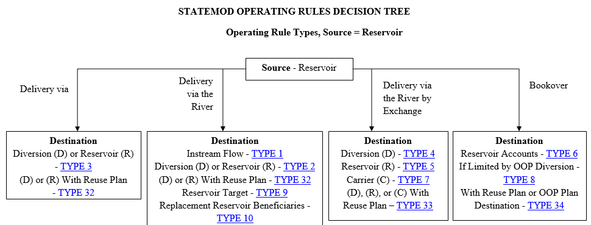
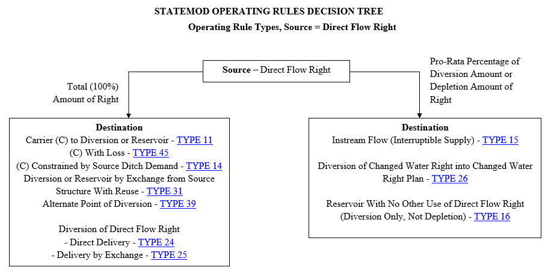
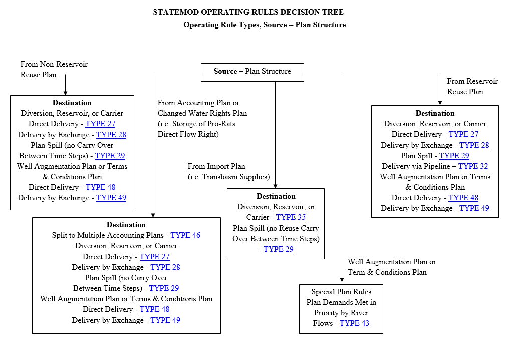
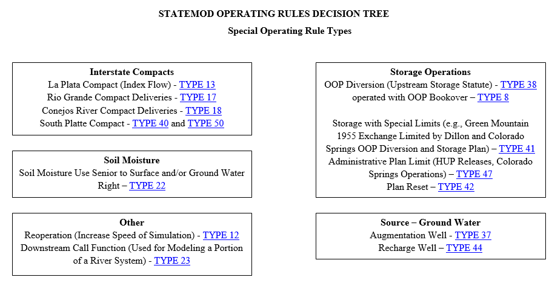

# Operational Right File (*.opr) #

The operational file describes unique or complex operations within the basin. Operating rules simulate these operations using the source, destination, priority, 
rule type and other parameters included in each  rule. Use of the terms “operational rights” and “operating rules” are used interchangeably herein. This file is 
read by subroutine **`OPRINP`**. As the data and information associated with this file varies based on the type of operational right selected, the input descriptions 
is repeated for each operating rule. 

Comments, indicated by a `#` in column 1 may be provided at any location in this file. It is recommended that a `#` sign be used specifically in the operating rule file 
to provide additional comments (as this file is not created using a DMI) and to turn off all lines associated with operating rules not used in a given scenario. In 
addition to any comments, it is recommended the following string be provided near the top of the file before any data `#FileFormatVersion 2` to indicate the format used 
in the file. If the format version indicator is not provided StateMod will try to read the file and try to determine the appropriate file type. Beginning with version 
12.0 an operating rule file format was adopted that includes six additional variables associated with water reuse, diversion type, etc. For a description of the old 
(\*.par file) format, which StateMod still supports, see [Section 9 - Discontinued but Supported Files](../Discontinued/91.md).

The following are noted:

* StateMod operating rules represent water being diverted or transferred from a Source to a Destination with a particular Delivery Method. Identification of these 
elements is necessary to select the appropriate operating rule for each situation.

* Sources can be the River (for direct flow and storage rights – see [Section 4.6](../Input Description/46.md) and [Section 4.12](../Input Description/412.md)), Ground Water (for well rights – see [Section 4.10](../Input Description/410.md)), a Reservoir 
(see [Section 4.11](../Input Description/411.md)) or a Plan structure (see [Section 3.9](../Model Description/39.md)).

* Destinations can be diversion structures, reservoirs, instream flows, or plan structures

* StateMod operating rules deliver water to meet demands via the river or through a carrier. Water delivered by the river is self explanatory. For example, a 
reservoir release to the river that is later diverted or exchanged from the river by ditch.  StateMod considers the delivery method to be a carrier when water 
is delivered from one structure by another structure without being released to the river. For example, the delivery from an off-channel reservoir to an irrigation 
demand directly located below the reservoir. All carriers such as canals, ditches, laterals, pipelines, tunnels, etc are treated as diversion structures.

Delivery Method Relative to the Source:

| Delivery Method	| Description 	|
| ---------------	| -----------	|
| River				| Release to the river then divert directly or by exchange |
| Carrier			| Release to a carrier. Water is transported to a user by a canal, it is not released to the stream system. |
| Bookover			| Transfer from one reservoir account to another account or another reservoir (water is not physically moved) |
| Alternate_Point	| Divert at a different location than the water right |
| Out_Of_Priority	| Out of Priority |

* Destinations can be diversion structures, reservoirs, instream flows, or plan structures

* A total of 11 generic operating rule types were originally sufficient for development of all of the western slope planning models. Development of the Rio Grande planning model required 
eight new rule types. One more rule type was added to support revisions to the San Juan model. Two more rule types were added when representation 
of the Blue River decree operations was added to the Colorado model. Recently, in preparation for the South Platte planning model, 27 new rule types 
have been added to the StateMod executable, bringing the total to 50 operating rule types.

* The original 11 operating rule types typically addressed a single Source, multiple Destination types, and a single Delivery Method. Pursuant to the continuing development 
of the model there is some redundancy with the original operating rule types and a subsequent one that provides the same functionality but has more flexibility. For example, 
the Carrier without Loss rule (type 11) can be replaced with the Carrier with Loss rule (type 45) by simply setting the carrier loss to zero. 

* There are two ways to set the beginning and ending years of operation for an operating rule. Originally the annual on/off switch (`ioprsw(1)`) defined either the starting or 
ending year of operation for a rule, but this functionality was enhanced by the development of the the start/end date (`IoBeg`, `IoEnd`) fields. It is recommended the start/end 
dates be used to define the period of operation for the rules.

Descriptions of each operating rule and their associated input variables, are included in Sections [Sections 4.13.1](../Input Description/4131.md) to [Section 4.13.50](../Input Description/41350.md). 
Examples of each operating rule are provided in [Section 4.13.51](../Input Description/41351.md).

[Figure 1](#figure1) through [Figure 4](#figure4) are flow charts developed to assist a user to select the appropriate operating rule. [Figure 1](#figure1) through [Figure 3](#figure3) provide information when the source of water is a Reservoir, 
Direct Flow Right or a Plan Structure, respectively. [Figure 4](#figure4) provides information for special rules that have been developed for unique circumstances (e.g. Rio Grande compact, 
South Platte River compact, Augmentation Wells, etc.). These figures can be used by selecting the appropriate figure based on the source of water, and selecting the appropriate 
subset (Delivery Method, Ownership, Plan Type, Special Rule) that meets a user’s needs. 

Following are five (5) examples of how to use these figures to select the appropriate operating rule: 

**Example 1** - Release water from a reservoir (Source) to a direct diversion (Destination) by river exchange (Delivery Method)

* On [Figure 1](#figure1) (Source – Reservoir), follow the arrow titled “Delivery via the River by Exchange”. Continue down that arrow to the arrow titled Destination “Diversion”, resulting in use of type 4 operating rule (see [Section 4.13.4](../Input Description/4134.md)).

**Example 2** - Diversion of an entire (100%) direct flow right (Source) to an off-channel reservoir (Destination) through a carrier structure (Delivery Method) with or without loss.

* On [Figure 2](#figure2) (Source - Direct Flow Right) , follow the arrow titled “Total (100 percent) Amount of Right” to Destination “Carrier to a Diversion or Reservoir”, resulting in use of type 11 operating rule (see [Section 4.13.11](../Input Description/41311.md)). If carrier losses associated with diversions to storage are to be representedthe Destination “Carrier to Reservoir with Loss” would result in use of a Type 45 operating rule (see [Section 4.13.45](../Input Description/41345.md)).

**Example 3** - Release reusable water stored in a Plan (Source) and Reservoir to meet Terms & Conditions on a neighboring tributary (Destination) via a river exchange (Delivery Method) 

* On [Figure 3](#figure3) (Source – Plan Structure) follow the arrow titled “From Reservoir Reuse Plan” to Destination “Terms & Conditions Plan Delivery by Exchange”, resulting in use of type 49 operating rule (explained further below in [Section 4.13.49](../Input Description/41349.md)).

**Example 4** - Represent the South Platte Compact

* On [Figure 4](#figure4) (Special Operating Rules) select the box titled “Interstate Compacts” to Destination “South Platte Compact”, resulting in use of type 40 and type 50 operating rules (see [Section 4.13.40](../Input Description/41340.md) and [Section 4.13.50](../Input Description/41350.md)); 

**Example 5** - Operate an Augmentation Well

* On [Figure 4](#figure4) (Special Operating Rules) select the box titled “Source – Ground Water” to Augmentation Well, resulting in use of type 37 operating rule (explained further below in Section [Section 4.13.49](../Input Description/41349.md)).

**

Figure 1 - Operating Rule Types, Source = Reservoir (<a href="../413_1.PNG">see also the full-size image</a>)

**

**

Figure 2 - Operating Rule Types, Source = Direct Flow Right (<a href="../413_2.PNG">see also the full-size image</a>)

**

**

Figure 3 - Operating Rule Types, Source = Plan Structure (<a href="../413_3.PNG">see also the full-size image</a>)

**

**

Figure 4 - Special Operating Rule Types (<a href="../413_4.PNG">see also the full-size image</a>)

**

| Item			| Destination Diverting Structure				| Source or Replacement Structure		| Operational Activity |
| ---------     | ----------------------------                  | -----------------------------         | 						| 
| 4.13.1		| Instream Flow									| Reservoir								| Reservoir to instream flow. Delivery by the river.
| 4.13.2		| Direct Flow or Reservoir						| Reservoir								| Reservoir to a direct flow or reservoir or carrier. Delivery by the river or carrier. 
| 4.13.3		| Direct Flow or	Reservoir					| Reservoir								| Reservoir to a carrier. Delivery by a carrier.
| 4.13.4		| Direct Flow	Reservoir						| Reservoir 							| Exchange to a Direct Flow. Delivery by the river.
| 4.13.5		| Reservoir										| Reservoir								| Reservoir Exchange to Storage. Delivery by the river.
| 4.13.6		| Reservoir										| Reservoir								| Bookover transfer between reservoir accounts.
| 4.13.7		| Diversion or Reservoir 						| Reservoir								| Reservoir to a Carrier by Exchange. Delivery by the river.
| 4.13.8		| Reservoir or Plan								| Reservoir or Plan						| Out-of-Priority Bookover. Bookover of an Out-of-Priority diversion.
| 4.13.9		| NA											| Reservoir								| Release for target contents. Delivery by the river.
| 4.13.10		| Direct Flow									| Reservoir								| General Reservoir Replacement. By direct release or exchange. Delivery by the river.
| 4.13.11		| Direct Flow or Reservoir						| Water Right							| Carrier Right to a ditch or reservoir. Delivery by a carrier.
| 4.13.12		| NA											| NA									| Reoperation Reoperate water rights
| 4.13.13		| Instream Flow									| Stream Gage							| Index flow constraint on an instream flow diversion. Note: La Plata Compact uses this Operating Rule.
| 4.13.14		| Direct Flow or Reservoir						| Direct Flow							| Carrier Right with constrained demand. Carrier constrained by the demand at both the destination and source. Delivery by the river.
| 4.13.15		| Instream Flow									| Water Right							| Interruptible supply based on a natural flow estimate. Transfer a direct diversion water right to an instream flow. 
| 4.13.16		| Direct Flow									| Water Right							| Direct Flow Storage. Allow the unused portion of a direct flow decree to be stored in a reservoir.
| 4.13.17		| Direct Flow									| Index Station 						| Rio Grande Compact - Rio Grande portion.
| 4.13.18		| Direct Flow									| Index Station							| Rio Grande Compact – Conejos River portion.		
| 4.13.19		| Direct Flow									| River									| Split Channel Operations
| 4.13.20		| NA											| Reservoir								| San Juan Reservoir RIP Operation
| 4.13.21		| Well											| NA									| Wells with Sprinkler Use	
| 4.13.22		| Direct Flow									| NA									| Soil Moisture Use and Well
| 4.13.23		| Downstream Call								| River									| Downstream Call. Operate a downstream call.
| 4.13.24		| Direct Flow or Reservoir or Plan				| Water Right							| Direct Flow Exchange. Supply a direct flow or reservoir or plan by exchange of a water right from river or carrier
| 4.13.25		| Direct Flow or Reservoir or Plan				| Water Right							| Direct Flow Bypass. Supply a direct flow or reservoir or plan by a bypass of a water right from river or carrier
| 4.13.26		| Changed Water Right Plan  					| Water Right							| Transfer a direct flow water water right to an administrative plan     
| 4.13.27		| Diversion or Reservoir						| Reservoir or Reuse Plan 				| Reservoir or Reuse Plan to a Diversion or Reservoir Direct with or without destination reuse Supply a diversion or Reservoir from a Reservoir or Reuse Plan directly from the river or a carrier
| 4.13.28		| Diversion or Reservoir						| Reservoir or Reuse Plan 				| Reservoir or Reuse Plan to a Diversion or Reservoir by exchange with or without destination reuse. Supply a diversion or reservoir from a reservoir or plan by exchange by Exchange from the river or a carrier
| 4.13.29		| NA											| Plan									| Plan Spill. Release water from a plan delivery by the river. Source water location is destination when Changed Water Rights Plan is source
| 4.13.30		| Reservoir										| Operating Rule 						| Reservoir rediversion. Redivert water released by another operating rule for a T&C plan
| 4.13.31		| Direct Flow or Reservoir						| Water Right							| Carrier Right with Reuse 
| 4.13.32		| Direct Flow or Reservoir or Carrier			| Reservoir & Reservoir Reuse Plan		| Plan Reservoir and Plan to a direct flow or reservoir or carrier direct with or without destination reuse. Delivery by the river or carrier
| 4.13.33		| Direct Flow or Reservoir or Carrier			| Reservoir & Reservoir Reuse Plan		| Plan to a Direct Flow or reservoir or carrier by exchange with or without destination reuse. Delivery by the river or carrier
| 4.13.34		| Reservoir										| Reservoir (bookover)					| Bookover with Reuse with Reuse 
| 4.13.35		| Import Diversion								| Acct.Plan								| Import to an Accounting Plan. Delivery by the river
| 4.13.36		| Direct Flow									| Water Right							| Seasonal (daily) Water Right (e.g. Meadow Rights)
| 4.13.37		| Plan											| Well Water Right						| Augmentation Well. Pump an augmentation well to satisfy a T&C or Well Augmentation plan requirement.
| 4.13.38		| Direct Flow or Reservoir or Carrier			| Water Right							| Out-of-Priority Diversion. Divert out-of-priority to a reservoir or a diversion with respect to a senior reservoir right. Addresses the upstream storage statute.
| 4.13.39		| Well or Diversion								| Water Right							| Alternate Point. Pump or divert using an alternate point of diversion
| 4.13.40		| Diversion or Instream Flow 					| River       							| South Platte Compact Release. Works in conjunction with a type 50 operating rule to 1) release water to a user that is water short and located upstream of the Washington county line (e.g not in Water District 64) or 2) to the South Platte compact itself.
| 4.13.41		| Reservoir										| Water Right							| Storage with Special Limits. Limit reservoir storage by the amount diverted by one or more Out-of-Priority Plans
| 4.13.42		| NA											| Plan									| Plan Reset
| 4.13.43		| Well Augmentation Plan						| River									| In-Priority Supply. Determine if well depletions from pumping in a prior time step or terms and conditions accounted for in a Plan structure are in priority
| 4.13.44		| Recharge Reservoir							| Well Water Right						| Recharge Well. Pump a recharge well to a Recharge Reservoir
| 4.13.45		| Direct Flow or Reservoir						| Water Right							| Carrier right with loss to a ditch or reservoir. Delivery by a carrier.
| 4.13.46		| Admin Plan									| Admin Plan							| Multiple Ownership
| 4.13.47		| NA											| Rel. Limit Plan 						| Monthly/Annual Plan Limits 
| 4.13.48 		| Direct Flow or Reservoir or Carrier			| Reservoir or Plan						| Reservoir or Plan to Plan Direct
| 4.13.49		| Plan or	Reservoir Reuse						| Plan									| Reservoir or Plan to Plan Exchange
| 4.13.50		| Plan          	 							| River       							| South Platte Compact Storage. Works in conjunction with a type 40 operating rule to allow water to be diverted in priority to a plan that represents the South Platte compact.