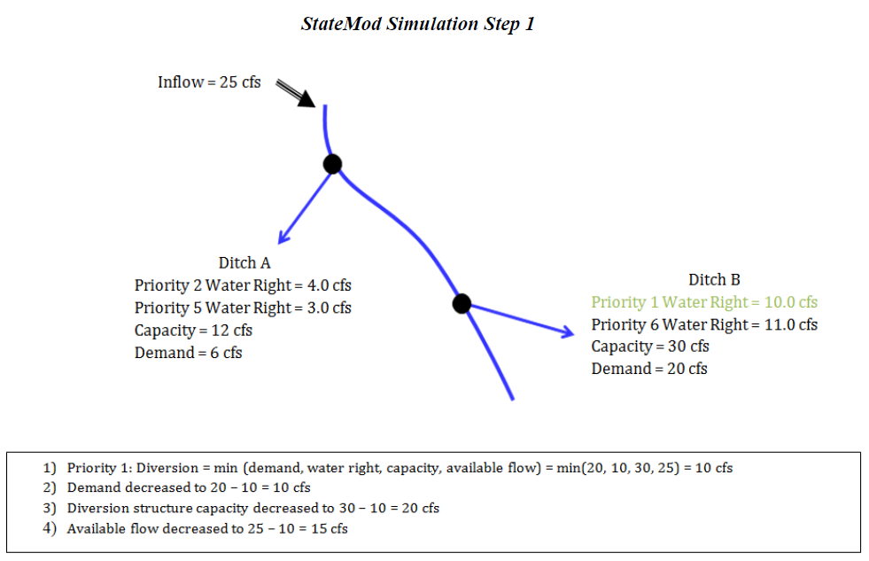
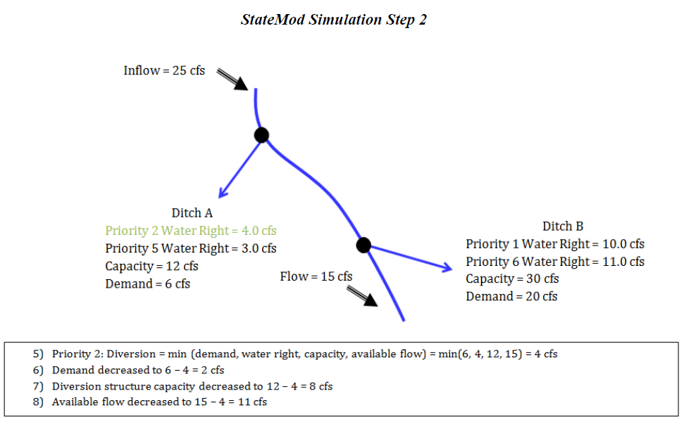
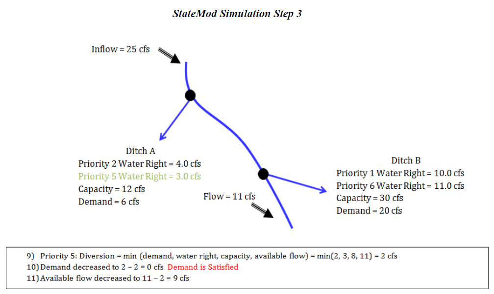
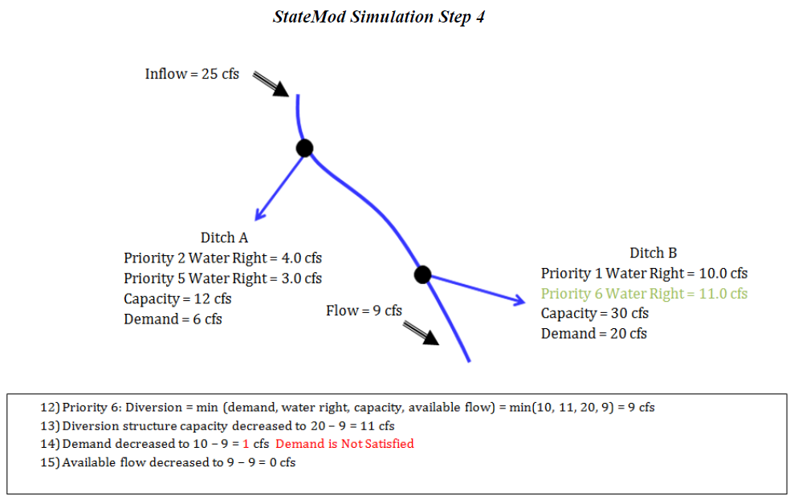
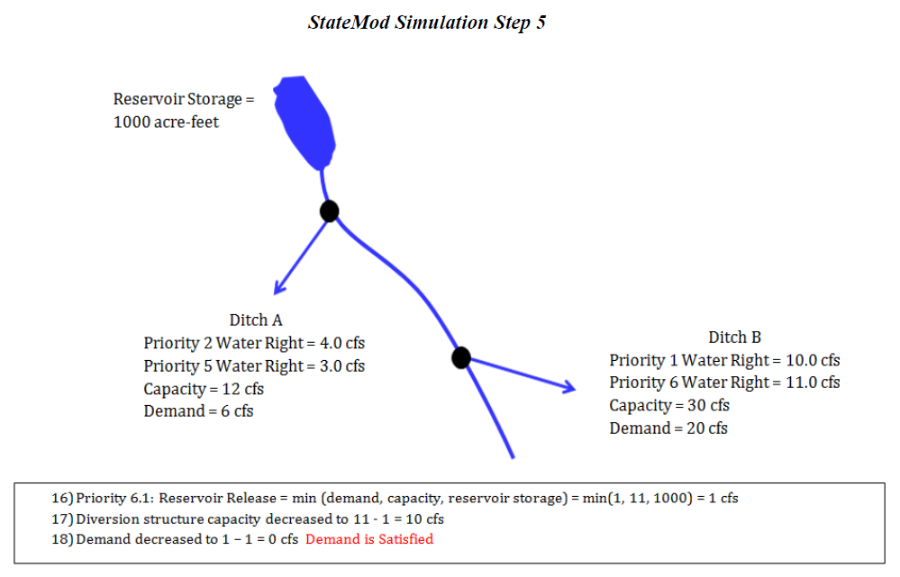

# Stream Flow Allocation #

The State of Colorado's Stream Simulation Model (StateMod) is capable of simulating stream diversions, instream demands, well pumping, 
reservoir operations and river flows on a monthly or daily basis for any stream system using user specified data. To facilitate this 
simulation, the river basin is divided into a series of river nodes which generally represent gauging stations, river confluences, diversion 
structures and reservoirs. Accounting is performed on a water right basis while reporting is performed by structure and each river node.

StateMod allocates water to a diversion, instream flow, or reservoir based upon physically available river flow, legally available flow (priority), 
decreed right, delivery capacity, and demand. Demand is an input to StateMod, but is typically estimated outside the model to reflect historical or 
future demands associated with agricultural, municipal, and industrial water needs. As a well may pump water from ground water storage, StateMod 
allocates water to a well using the same constraints described previously except it is not limited to physical availability of flow in the river. 
If current or future depletions caused by wells exceed the available flow, the water supply is identified as coming from ground water storage.

The water allocation scheme used in the current version of StateMod is the Modified Direct Solution Algorithm (MDSA) (Bennett, Ray R., December 2000). 
The MDSA is an enhancement to the Direct Solution Algorithm (DSA) that recognizes the impact of a diversion's return flows even when they occur in the 
same month or day that they were diverted. The enhancement associated with the MDSA allows water use efficiencies to vary up to a user specified maximum 
and account for soil moisture contents. The MDSA eliminates the need to iterate between time steps unless reservoir operations or return flows that do not 
accrue to a downstream node make new water available to the system.

Following is an abbreviated description of the stream allocation scheme, graphics depicting a simplified version of this approach follow:

1. Water availability is determined at each river node to include both native inflows and return flows accruing from a prior time step.

2. The most senior direct, instream, storage, well or operational water right is identified.

3. Diversions are estimated to be the minimum of the decreed water right, structure capacity, demand, and available flow in the river. 
For a direct flow or reservoir right, the available flow in the river is the minimum of the diverting or downstream node plus any of 
the diverting right’s return flow to that node at the current time step. For an instream right, the available flow in the river is 
the flow at each river node within the instream reach. For a well, pumping is not constrained by the available flow in the river 
since pumping may deplete ground water storage.

4. Downstream flows are adjusted to reflect the senior diversion and its return flows.

5. Return flows for future time periods are determined and stored.

6. Well depletions for future time periods are determined and stored.

7. The process is repeated by priority for each successive direct, instream, storage, well and operational water right.

8. If new water is introduced to the system from a reservoir's operation or return flows accrue to a non-downstream node, the model reoperates the 
current time step and the process is repeated beginning with the most senior direct, instream, storage or operational right.

9. The process is repeated for each month or day of the study period.

StateMod allocates water by priority, therefore if the administration numbers of two water rights are the same, their relative priority is set by 
StateMod based on the order it is read within a file and between data files as follows: instream flows, reservoirs, diversions, operating rights, 
and wells. It is recommended that the user review the list of water rights as read by StateMod in the water rights summary (\*.xwr) file and overwrite 
administration numbers as appropriate to trigger based on actual operations. The user can generate a water rights summary (\*.xwr) file by running the 
**Report Option 4 – Water Rights List**.

**

Figure 1 - StateMod Simulation Step 1 (<a href="../31_1.PNG">see also the full-size image</a>)

**

**

Figure 2 - StateMod Simulation Step 2 (<a href="../31_2.PNG">see also the full-size image</a>)

**

**

Figure 3 - StateMod Simulation Step 3 (<a href="../31_3.PNG">see also the full-size image</a>)

**

**

Figure 4 - StateMod Simulation Step 4 (<a href="../31_4.PNG">see also the full-size image</a>)

**

**

Figure 5 - StateMod Simulation Step 5 (<a href="../31_5.PNG">see also the full-size image</a>)

**