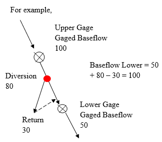

# Gaged Base Flow Estimate File (*.xbg) #

The Gaged Base Flow Estimate file (\*.xbg) contains base flow estimates at each gage location provided in the Stream 
Station input file ([Section 4.4](../InputDescription/44.md)). Note, this file is typically used to allow man’s impact to be removed from gaged data
prior to filling gaps using a technique such as regression. It contains the following data: 

| Column          | Description  |
| -----------     | -----------  |
| Year            | Simulation year
| ID              | River station ID
| Oct             | Base flow in Oct (the first month specified in the control file ([Section 4.2](../InputDescription/42.md)))
| Nov - Dec       | Same as above for each month of the year
| Total           | Total annual flow for the year

Repeat for each River ID and year

**

(<a href="../512.PNG">see also the full-size image</a>)

**