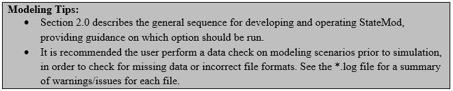
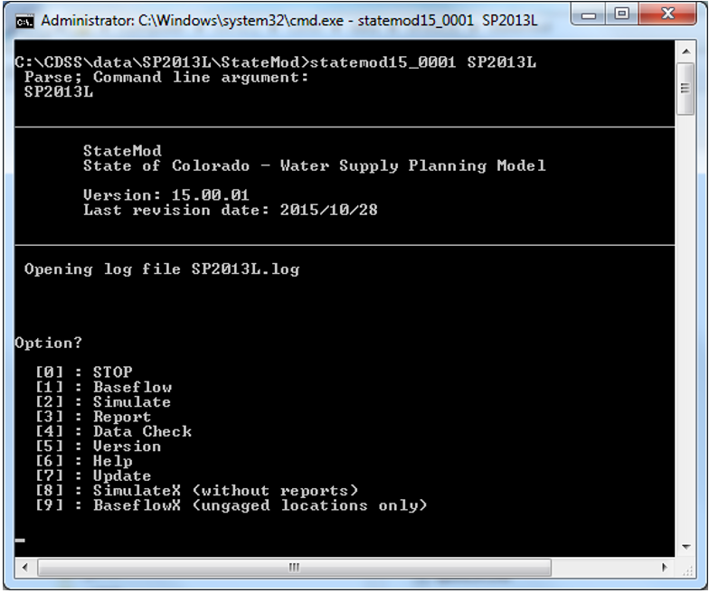
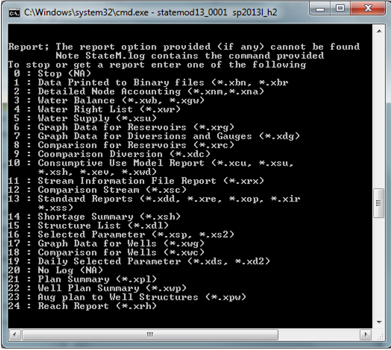

# Running the Model #

This chapter provides technical notes on selected operations, guidance for frequently asked questions 
regarding the operation of StateMod, and standard and accepted StateMod modeling procedures for implementing 
the various operations. It is recommended the user follow these approaches, however if the approaches are adapted 
for more specific operations, it is the user’s responsibility to test and verify the results. 

StateMod can be executed through either the StateMod GUI or through command line arguments. See the StateMod GUI User’s 
Manual for more information on how to execute the model through the GUI. In a command line, it is recommended that the 
user first call for the StateMod executable along with the specific response file (\*.rsp), then select the option using 
the prompted menu. [Figure 5](#figure5) shows the command line argument calling for StateMod Version 15.00.01 (statemod15_0001) and 
the Lower South Platte Model scenario (SP2013L).  The resulting options can then be selected to create natural flows 
(baseflows), simulate the model, report results, or perform a data check on the model input files.  [Table 1](#table1) summarizes 
the functionality of each option; a more detailed summary of each option is provided in [Section 3.3](../Model Description/33.md). Although it is 
recommended to execute options using the menu, options shown in [Table 1](#table1) can be included after the response file in the 
command line argument and executed using a single command. 

**

Figure 5 - Model Execution Command Line Example (<a href="../71_5.PNG">see also the full-size image</a>)

**

**

Table 1 - StateMod Menu Options

**

| Menu Option			| Command Line Designation				| Description |
| -------------------   | ------------------------------------  | ----------- |
| 0. STOP				| N/A									| Exit out of current scenario
| 1. Baseflow			| `-base` or `-baseflow`					| Perform baseflow option and generates baseflows at all locations if data is available.
| 2. Simulate			| `-sim` or `-simulate`						| Perform simulate option with standard reports
| 3. Report				| `-rep` or `-report`						| Perform report option
| 4. Data Check			| `-chk` or `-check`						| Perform data check option
| 5. Version			| `-v` or `-version`						| Print the program version
| 6. Help				| N/A									| Option not currently functional
| 7. Update				| `-u` or `-update`							| Print recent StateMod updates
| 8. SimulateX			| `-simx` or  `-simulatex`					| Perform simulate option without standard reports
| 9. BaseflowX			| `-basex` or `-baseflowx`					| Perform baseflow option for ungaged areas only (option typically used after baseflows at gaged locations have been generated and need to be distributed to ungaged areas)

If the Report option (3) is selected, the user will be prompted with a menu of available reports to select from, as shown in 
[Figure 6](#figure6). Descriptions of the information in each output report can be found in [Section 5.0](../Output Description/50.md). If the `-rep` option is used, 
additional parameters are required in order to request the desired report and desired station as appropriate, by including a report 
output command. For example, the user can included `-xdc` following `–rep` in the command line argument to create the Diversion Comparison 
output file.  A complete list of available report output commands can be found in [Section 5.0](../Output Description/50.md).

**

Figure 6 - StateMod Report Options (<a href="../71_6.PNG">see also the full-size image</a>)

**