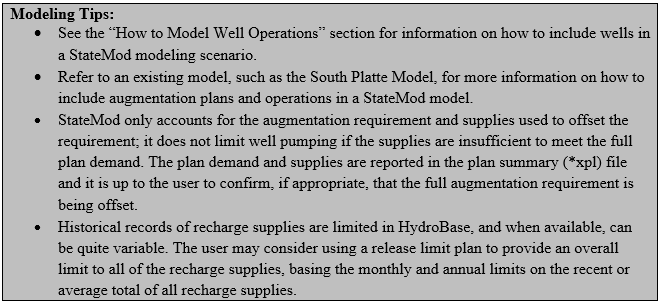

# How to Model Augmentation Plans #

A well augmentation plan is typically the result of an engineering analysis that allows a well to divert 
out-of-priority and replace the river depletions with one or more replacement water sources in order to 
avoid injury to senior water rights. StateMod calculates the depletion at a river associated with well 
pumping in the current time step and all future time steps based on the amount pumped, the efficiency of 
its use, and its associated depletion pattern (e.g. unit response function). If a well water right is tied 
to an augmentation plan, any depletion associated with out-of-priority pumping (i.e. augmentation requirement) 
is stored in that plan in the current and all future time steps. The augmentation requirement is the 
difference between the well’s depletion on the river and the accretions from any associated return flows. 
These augmentation requirements may be “offset” by a number of supplies, including:

* Depletions that accrue to the river in the current time step in-priority; accounted for automatically by StateMod 
* In-priority depletions that accrue to the river from pumping in prior time steps. 
* Accretions from decreed recharge areas or canal seepage 
* Releases from a reservoir 
* Pumping from Augmentation or Recharge Wells 

A Special Augmentation Plan, discussed in more detail below, is used to account for depletions associated with a 
well or group of wells that are not required to be augmented. Examples include pumping in Designated Basins or 
pumping by wells decreed to be non-tributary (e.g. Coffin Wells). A Special Augmentation Plan can track these 
depletions, however does not generate an “augmentation requirement” and therefore does not have associated 
supplies.

