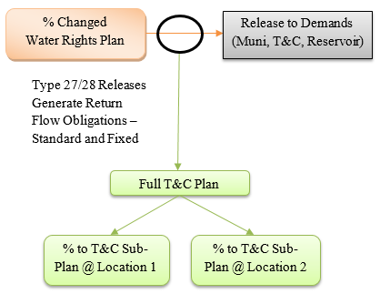
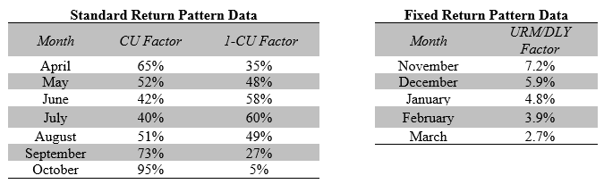
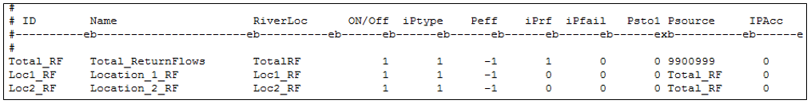
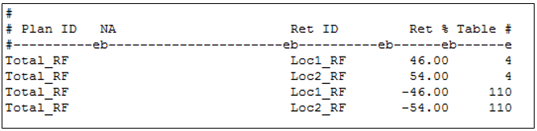
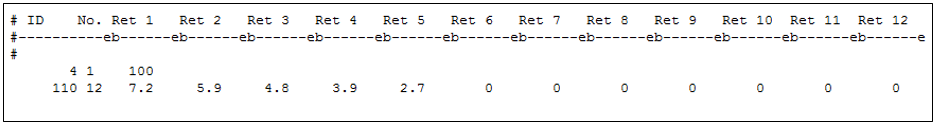
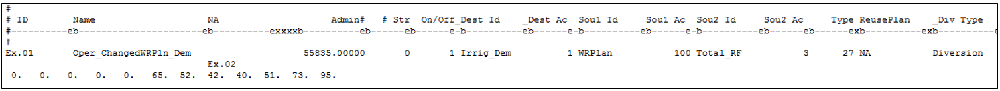

# Terms and Conditions Operations #

“Terms and Conditions” is language used to collectively represent the return flow obligations associated with 
the transfer or change of water right. They generally represent the amount, timing, and location of non-consumed 
water returned to the river from the historical use of the changed water right. StateMod generates these return 
flow obligations during simulation based on the amount of changed water used to meet a demand, the consumptive 
use (CU) factors, and the unit response function. The Terms and Condition (T&C) plan stores the return flow 
obligations (plan demand) for current and future time steps. The obligations can be “offset” by a number of 
supplies, including changed water rights, reusable supplies, and/or reservoir releases. Note that StateMod only 
accounts for the return flow obligation and supplies used to offset this plan demand; it does not limit the use 
of changed water rights if the supplies are insufficient to meet the full plan demand. The plan demand and 
supplies are reported in the plan summary (\*.xpl) file and it is up to the user to confirm, if appropriate, that 
the full return flow obligation is being offset.

There are three types of return flow patterns:

* \\(\text{Standard Return Pattern} = (\text{Data in the return flow} (\*.urm/\*.dly) \text{ file}) * (\text{Released Water}) * (1.0-\text{CU Factor})\\)
where the CU Factor is provided in the operating rule that releases water from the Changed Water Rights Plan. This 
return flow pattern either reflects the “immediate summer” return flow obligations owed to the river in the same 
time step as the release of water occurs, or reflects return flow obligations strictly based on the original irrigation 
pattern.
* \\(\text{Fixed Return Pattern} = (\text{Data in the return flow} (\*.urm/\*.dly) \text{ file}) * (\text{Released Water}) \\) 
whereby a “fixed” percentage of each month’s releases becomes the return flow obligation. Generally used to represent 
“winter return flows” obligated based on the total amount released or “used” during the summer.
* \\(\text{Mixed Return Pattern} = \text{Standard Return Pattern} + \text{Fixed Return Pattern}\\)

Additionally, StateMod allows the user to split the return flow obligation to different locations on the river. The following 
schematic provides an example of return flow obligations operations; the plan structures and operating rules used to represent 
these operations are discussed in more detail below.

**

Figure 10 - Terms and Conditions Plan Example Operations (<a href="../711_3_a.PNG">see also the full-size image</a>)

**

**

Example T&C Return Pattern Information (<a href="../711_3_b.PNG">see also the full-size image</a>)

**

1. Open the network (\*.net) in StateDMI, navigate to the appropriate location, and right-click to `Add an Upstream Location`. 
Enter the appropriate location and structure information and designate the structure type as a plan. 
	* The T&C plan should be located where the historical return flows generally accrued, or the location set in the decree. 
	The return flow obligation will be administered at the location of the plan, therefore the location can impact how much of 
	the plan demand is in-priority or what supplies are available to offset the demand.
2. Recreate the river network file (\*.rin) to reflect the additional structure.
3. In the plan file (\*.pln), include the well augmentation plan as a Type 1 Plan and include the appropriate parameter information. 
See [Section 4](../Input Description/40.md) for more discussion on the information in and format of this file.	

    
    
    **

    Example Plan (.pln) File (<a href="../711_3_c.PNG">see also the full-size image</a>)
    
**

4. Using a text editor, create the plan return flow (\*.prf) file to split the return flow obligations between plans and associate 
return flow patterns to each T&C plan. See [Section 4](../Input Description/40.md) for more discussion on the information in and 
format of this file. 
	* The Plan ID reflects the full T&C Plan, the Return ID reflects the sub-plans, and the Ret % reflects the portion of 
	obligations assigned to each sub-plan (T&C Location).  
	* Negative Ret % values indicate a fixed return flow pattern, and the Table field generally corresponds to a lagged pattern.  
	* Positive Ret % values indicate a standard return flow pattern, and the Table field generally corresponds to an “immediate” 
	pattern (i.e. 100 percent returns in the first month). 
	* If a mixed pattern is used, an entry must be included for the standard and the fixed return flow patterns.
	* In the example below, the full T&C plan is split 46/54 percent to two sub-plans (`Loc1_RF` and `Loc2_RF`). Each sub-plan has a 
	standard and fixed return flow pattern; see below for discussion on the Table values for each.

    
    
    **

    Example Plan Return (*.prf) File (<a href="../711_3_d.PNG">see also the full-size image</a>)
    
**
	
5. Using a text editor, update the return flow (\*.urm/\*.dly) file to include the immediate and lagged pattern associated with the 
standard and fixed return flow obligations, respectively.  See [Section 4](../Input Description/40.md) for more discussion on the 
information in and format of this file.
	* The lagged return flows are generally decreed in the change of use decree. 

    
    
    **

    Return Flow File (\*.urm/\*.dly) (<a href="../711_3_e.PNG">see also the full-size image</a>)
    
**
	
6. In the operating rule (\*.opr) file, include a Direct Plan/Reservoir Release Operating Rule (Type 27) and the Exchange 
Plan/Release Operating Rule (Type 28), depending on the location of the destination, to release water from the changed water 
right plan to a demand. 
	* See the section [Releases from a Changed Water Right Plan](../Standard Modeling Procedures/7112.md) for more information 
	on the data included in these operating rules.  
	* Specific to the T&C plan, include the plan ID in the `ciopso(2)` field and include the CU Factors if a standard return 
	flow pattern is being simulated.

    
    
    **

    Operating Rule File (*.opr) (<a href="../711_3_f.PNG">see also the full-size image</a>)
    
**
	
	In this example, if the Type 27 operating rule carried 10 acre-feet (af) in May: 
	
	* The total standard return flow obligation would be 4.8 af (10 af \* (1-52%)) in May
	* The total fixed return flow obligation would be 0.72 af in November, 0.59 af in December, 0.48 af in January, 0.39 af in February, and 0.27 af in March.
	* 46 percent of the total obligation would be owed to the river at Location 1 (`Loc1_RF`)
	* 54 percent of the total obligation would be owed to the river at Location 2 (`Loc2_RF`)

Once a T&C Plan Return Flow Obligation is generated by the model, it is up to the user to offset these obligations in the 
time step and location they accrue to. If return flow obligations are not required to be offset after a specific priority, 
the user can use include a Type 43 operating rule to reduce the obligation based on that priority. There are many possible 
supplies to offset return flow obligations; in general, Type 27/28 and Type 48/49 operating rules are used to release supplies
to meet a return flow obligation. The plan demand and supplies are reported in the plan summary (\*.xpl) file and it is up to 
the user to confirm, if appropriate, that the full return flow obligation is being offset.