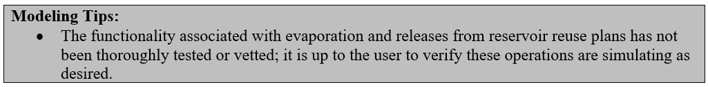

# How to Model Reusable Supplies #

StateMod uses plan structures to track (color) reusable water in the river, in storage, and from water imported into the river system. 
This provides the opportunity for users to differentiate between one-time use water and reusable water when making releases from storage 
or from plans to meet various demands. There are two plan types, a Plan Type 3 – Reservoir Reuse Plan and a Plan Type 4 – Non-reservoir 
(Diversion) Reuse Plan, which can be used to track reusable water.  

Reservoir reuse plans are modeled in conjunction with reservoir accounts and track the portion of the storage that can be reused. 
Water in reservoir reuse plans can be carried over between time steps and does not need to be spilled at the end of a time step. 
Reusable water is stored in a reservoir reuse plan by including the reuse plan ID (`creuse` field)  in the operating rule used to stored 
water in the reservoir, “coloring” that water as reusable. Another operating rule can then release the reusable supplies from the reservoir 
to meet a specific demand.  

Non-reservoir reuse plans are used to track reusable supplies associated with imports, direct diversions, and changed water rights. 
Examples include wastewater treatment plant effluent, imported water that can be used to extinction, or the consumptive use portion of 
a changed water right.  Water in non-reservoir reuse plans cannot be carried over between time steps and must be spilled at the end of 
the time step. Reusable water is generally stored in a non-reservoir reuse plan by including the reuse plan ID in operating rules:

* used to carry a water right to meet a demand (e.g. Type 24 or 25 operating rules)
* used to release water from a Changed Water Right plan or Import plan to meet a demand (e.g. Type 27 or 28 rules)

The non-consumed portion is then stored in the non-reservoir reuse plan, which can then be released to meet another demand using another 
operating rule (e.g. Type 32 or 33 rules).  

Due to the numerous options available to put water into and release water from reservoir and non-reservoir plans, a step-by-step approach 
is not provided. The following bulleted list provides a general approach to implementing these operations. Note that this approach does 
not include the steps to implement a Changed Water Right plan or an Import plan. The user can refer to other information in the documentation 
for more information on those plan structures.

* Include the reservoir and non-reservoir reuse plans in the network (\*.net) and the river network (\*.rin) files using StateDMI.
* Include the reservoir and non-reservoir reuse plans in the plan (\*.pln) file, designating them as either Plan Type 3 or 4.
* The most common operating rules used to store and release water in a reservoir or non-reservoir reuse plan are Types 24, 25, 27, 28, 32, 
and 33 operating rules. The reuse plans are generally designated in these operating rules types as an associated reuse plan in either the 
`ciopso(2)` or the `creuse` fields. These operating rules also allow monthly and annual volumetrics and/or terms and conditions to be specified 
with the use of the reusable supplies.
* Include a Plan Spill Type 29 operating rule for all non-reservoir reuse plans.
* Review the plan summary (\*.xpl) file to review the amount of reusable supplies stored and released from each plan.

