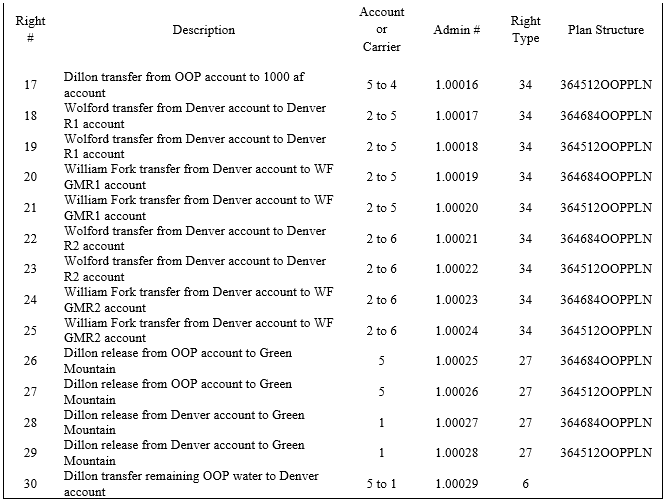

# Blue River Decree (Upstream Storage and OOP Plans) #

In brief, the Blue River Decree allows Dillon Reservoir, Roberts Tunnel, Upper Blue Lakes, and Continental-Hoosier Tunnel to store 
or divert out of priority with respect to Green Mountain Reservoir’s first fill decree. The water diverted or stored out of priority 
at each structure is tracked in an Out-of-Priority (OOP) plan. If Green Mountain Reservoir does not fill under its storage rights at 
a user-specified priority, Denver and Colorado Springs are required to “repay” Green Mountain from various reservoirs to meet the OOP 
obligation.

Blue River Decree operations are very complex and involve several operations and structures; the user should refer to the Colorado 
River Basin Water Resources User’s Manual for information on the specific operations.  The summary provided herein is used to illustrate 
the general functionality of the operations and provide sufficient information for the user to potentially implement these operations in 
other models. 

This summary will focus on a simplified representation of the Blue River Decree operations as they pertain to out-of-priority storage in 
Dillon Reservoir.  When Denver incurs an obligation to repay Green Mountain Reservoir for water stored out-of-priority at Dillon Reservoir, 
provisions of the Blue River Decree, as more specifically described in a 1964 Stipulation and Agreement, allow Denver to replace the water 
owed by substituting releases from its Williams Fork Reservoir. In 1991, the agreements were again modified and allowed use of Wolford 
Mountain Reservoir as an additional source of substitution supply for water owed to Green Mountain Reservoir by Denver. The following 
structures and operations are used to model these Dillon Reservoir operations.

* **Out-Of-Priority Plans (Plan Type 9)**. The OOP plan tracks and stores the OOP storage or diversion amount; the user is then responsible 
for providing supplies that offset the OOP obligation. An OOP plan should be included for each OOP storage or diversion; the Dillon Storage 
OOP Plan is modeled as `364512OOPPLN`. The OOP plan is included in the network (\*.net) diagram, river network file (\*.rin), and the plan file 
(\*.pln). 

    
    
    **

    Colorado River Basin Model - Plan (*.pln) File Excerpt (<a href="../7161_a.PNG">see also the full-size image</a>)
    
**
	
* **Reservoir Structures**. Much of the Blue River Decree operations center on selective use of specific reservoir accounts and bookovers. 
Dillon Reservoir, shown below, has specific accounts used to manage the OOP bookover operations, these accounts are not tied to any other 
users of the reservoir.

    
    
    **

    Colorado River Basin Model – Reservoir Station (*.res) File Excerpt (<a href="../7161_b.PNG">see also the full-size image</a>)
    
**
	
* **Operating Rules**. The Blue River Decree operations associated with OOP plans use several operating rules. 
	* **OOP Diversions** (Type 38) allows a reservoir to store (or a carrier to divert) OOP with respect to a more senior reservoir storage. 
	This rule was developed based on the Upstream Storage Statute; upstream reservoirs can store before a more senior downstream reservoir, 
	however the upstream storage stored OOP must be repaid to the senior reservoir right if it is not satisfied. Therefore, as shown below, 
	the more junior Dillon Reservoir right can store before the more Green Mountain Reservoir and the OOP obligation is stored in the OOP 
	plan. 
		* The destination of the rule is Dillon Reservoir (`364512`), the primary source is the senior subordinated Green Mountain storage 
		right (`363543.01`), and the secondary source is the junior Dillon Reservoir storage right (`364512.01`). 
		* The priority of the operating rule is set senior to the Green Mountain storage right, allowing it to simulate prior to storage 
		in Green Mountain Reservoir.

**

Colorado River Basin Model – Type 38 Rule Example (<a href="../7161_c.PNG">see also the full-size image</a>)

**

* **Reservoir Storage with Special Limits (Type 41)** allows a reservoir to store under a reservoir right up to the volume of water in 
an OOP plan.  This rule was developed specifically for the Blue River Decree operations, and allows Green Mountain to store, under a 1955 
right, the amount of water that was diverted and stored OOP to Green Mountain’s senior first fill right. When water is stored under this 
right, it reduces the OOP obligation owed by Denver and Colorado Springs proportional to their OOP operations. This rule operates after the 
out-of-priority operations are complete which allows for a pro rata amount to be credited to each of the four out-of-priority plans. When 
the amount stored under this right equals out-of-priority operations by both cities, the right is satisfied.

**

Colorado River Basin Model – Type 41 Rule Example (<a href="../7161_d.PNG">see also the full-size image</a>)

**

* **Plan Demand Reset (Type 42)** is used to reset the OOP plans to zero at a specific priority and specific time step. The Dillon 
Reservoir OOP plan is reset at the most junior priority in the model (`99999.99999`) on March 31st of each year.  
	* Note that this operating rule can also reset T&C Plans (Plan Type 1) or a Well Augmentation Plan (Plan Type 2), if applicable.
* There are 14 operating rules, including ** Bookover with Plan (Type 34), Bookover (Type 6)** and **Direct Plan/Reservoir Release Operating Rule (Type 27)**, 
used to simulate Denver’s OOP obligation replacement operations. Denver has the ability to repay OOP 
obligations from three reservoirs –Dillon Reservoir, Wolford Mountain, and Williams Fork. Wolford Mountain Reservoir and Williams 
Fork Reservoir each have two accounts to which Denver can transfer water for replacement. Denver prefers to meet the OOP obligation 
during substitution years using the bookover operations (Type 34 and 6), however if these supplies are not sufficient, Dillon Reservoir 
can release directly to Green Mountain Reservoir via the Type 27 operating rule.

**

Colorado River Basin Model – Documentation Excerpt (<a href="../7161_e.PNG">see also the full-size image</a>)

**

**

Colorado River Basin Model – Type 34 Rule Example (<a href="../7161_f.PNG">see also the full-size image</a>)

**

