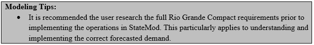

# Rio Grande Compact #

The Rio Grande Compact of 1938 apportioned water based on the variable river conditions during the Compact Study period (1928 – 1937). 
Therefore, the amount of water that Colorado has to deliver downstream varies based on the actual or forecasted river conditions as 
measured at index gages (Rio Grande near Del Norte, Conejos River near Magote, Los Pinos river near Ortiz, and the San Antonio river 
near Ortiz). The more water produced in the Rio Grande River basin, the more water Colorado owes to downstream states. The State Model 
allows the Rio Grande Compact to be simulated as an operating rule with the following features:

* Compact demands are reflected as forecasted (negative) data in the monthly instream flow demand file. 
* Compact “trigger” parameters are reflected in specific operating rules (Type 17 for the Rio Grande River, Type 18 for the Conejos River).

The following approach summarizes the approach to implement the Rio Grande Compact at both the Rio Grande River and Conejos River locations.

1. In the network (\*.net) via StateDMI, add two instream flow structures to the model; one downstream of the Rio Grande River at 
Labatos streamflow gage and the other downstream of the Conejos River near La Sauses streamflow gage. Navigate to the appropriate 
locations, right-click to `Add an Upstream Location`, enter the appropriate information, and designate the structure type instream flow.
2. Recreate the river network file (\*.rin) to reflect the additional structures.
3. Add the structures to the instream flow station file (\*.ifs) using the StateDMI commands:
	* Set the same ID for the upstream and downstream nodes to reflect a point.
	* Set the demand type variable (`iifcom`) to a 1 to indicate monthly demand (\*.ifm) will be provided. 
4. Add the structure’s forecasted (negative) demand to the instream flow demand file (\*.ifm) using the TSTool commands.
	* For the Rio Grande demand, enter in the monthly forecast for each year as a negative number based on the April to September 
	forecast for the Rio Grande River Index Station (Rio Grande near Del Norte).
	* For the Conejos demand, enter in the monthly forecast for each year as a negative number based the April to September forecast 
	for the sum of the Conejos River Index stations (Conejos River near Magote, Los Pinos river near Ortiz and the San Antonio river 
	near Ortiz).
	* A zero should be entered for months without a forecast.
	* Set the monthly instream flow demands or read in an external StateMod formatted file (\*.stm) with the demand in CFS. Note that 
	if demand is entered in units of acre-feet, adjust the conversion factor (`ffacto`) for instream flow demands in the control (\*.ctl) 
	file and confirm all instream flow demands are provided in units consistent with this conversion.
5. In the operating rule (\*.opr) file, include a Rio Grande Compact - Rio Grande (Type 17) operating rule to estimate the demand for 
the Rio Grande instream flow demand. 
	* Set the destination to the Rio Grande instream flow structure
	* Set `source 1` to the stream gage that represents the index flow (e.g. Rio Grande at Del Norte) with a coefficient (account) of 1. 
	* Set `source 2` to the stream gage used to adjust to the discharge at the instream flow location (e.g. the combined discharge of the 
	Conejos River near La Sauses) with a coefficient (account) of -1. 
	* Set the appropriate information in the second line of the rule, including:
		* Year when annual obligation calculation includes an adjustment for cumulative surplus storage
		* Initial surplus/shortage for the Rio Grande in the year the operating rule triggers
		* Closed Basin annual yield to the Rio Grande River in acre-feet per year.
		* Norton Drain South annual yield to the Rio Grande River in acre-feet per year.
6. In the operating rule (\*.opr) file, include a Rio Grande Compact - Conejos River (Type 18) operating rule to estimate the demand for 
the Conejos River instream flow demand. 
	* Set the destination to the Conejos instream flow structure
	* Set `source 1` to the first index stream gage (e.g. Conejos River near Magote) with a coefficient (account) of 1.
	* Set `source 2` to the second index stream gage (e.g. Los Pinos River near Ortiz) with a coefficient of 1.
	* Set `source 3` to the third index stream gage (e.g. San Antonio River at Ortiz) with a coefficient of 1.
	* Set the appropriate information in the second line of the rule, including:
		* Year when annual obligation calculation includes an adjustment for cumulative surplus storage
		* Initial surplus/shortage for the Conejos River in the year the operating rule triggers
		* Closed Basin annual yield to the Conejos River in acre-feet per year.
		* Norton Drain South annual yield to the Conejos River in acre-feet per year.
7. Review the instream flow summary (\*.xir) file for information on instream flow demands and the portion of the demand met based on the 
Type 17 and 18 operations.

