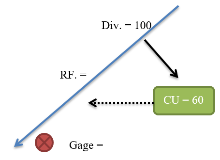
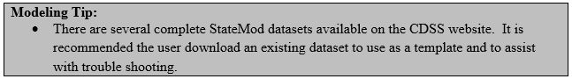
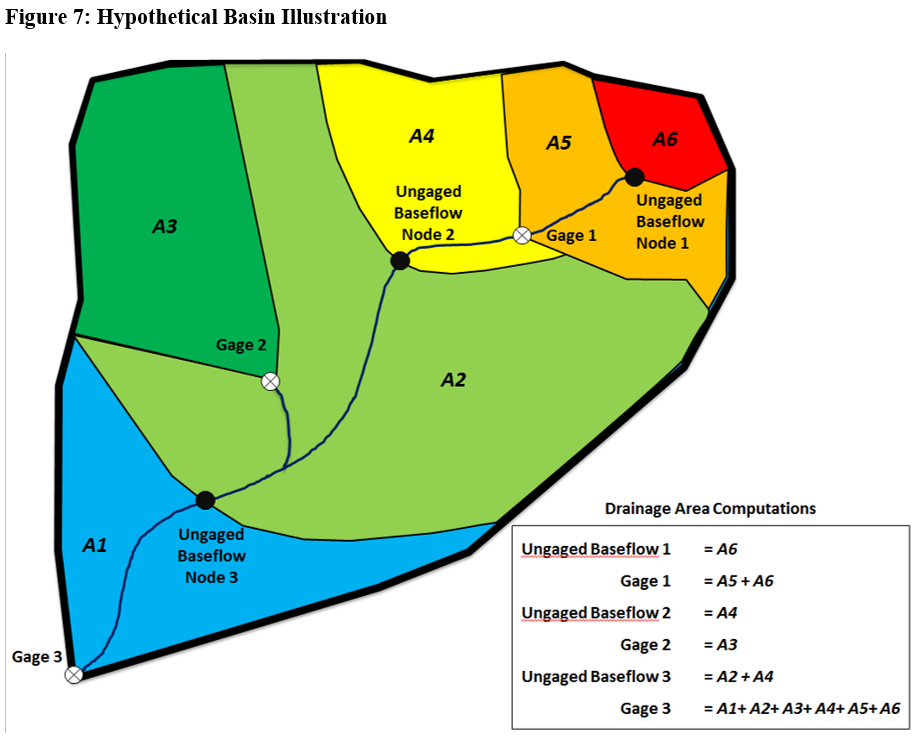
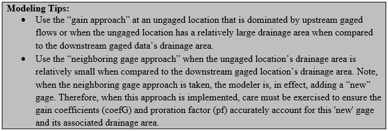

# Creating Natural Flows at Gages and Ungaged Locations #

As discussed in [Section 2.0](../Introduction/2.md), natural flows (or baseflows) represent basin streamflows absent man’s influence 
including diversions, return flows, reservoir operations and pumping. If 100% of man’s influence is removed, 
baseflows are often called virgin flows or natural flows. It is recommended that users first develop natural 
flows at gaged locations, and then distribute those natural flows to ungaged areas.  Natural flows at gaged and 
ungaged locations are then used as the natural flow input to simulation scenarios, such as Historical Calibration 
or Baseline scenarios.

$$\text{Natural Flow at Gaged Locations} =
+~\text{Gaged Flow}
+~\text{Upstream Diversions}
-~\text{Upstream Return Flows}
+/-~\text{Upstream Change in Storage}
+~\text{Upstream Evaporation}
-~\text{Imports}$$

\\(\text{Natural Flow} = 200 + 100 - 40 = 260\\)

The following steps are recommended to develop a scenario to estimate Baseflow:

1. Create a model scenario that includes a minimum of the following files , as designated in the response file (\*.rsp):

	* Control (\*.ctl)
	* River_Network (\*.rin)
	* StreamGage_Station (\*.ris) 
	* StreamGage_Historic_Monthly (\*.rih) 
	* Diversion_Station (\*.dds) 
	* Diversion_Right (\*.ddr) 
	* Diversion_Historic_Monthly (\*.ddh) 
	* DelayTable_Monthly (\*.dly) 
	* Reservoir_Station (\*.res) 
	* Reservoir_Right (\*.rer) 
	* Evaporation_Annual (\*.eva) 
	* Reservoir_Target_Monthly (\* tar)
	* Reservoir_Historic_Monthly (\*.eom) 

2. If crop consumptive use is known and variable efficiency will be considered, also include the following files:

	* IrrigationPractice_Yearly (\*.ipy)
	* ConsumptiveWaterRequirement_Monthly (\*.iwr)
	* StateCU_Structure  (\*.str) 
	
3. If well structures and pumping will be considered, also include the following files:

	* Well_Station (\*.wes)
	* Well_Right (\*.wer)
	* Well_Historic_Monthly (\*.weh)  

4.	Run the Baseflow option with the scenario to create natural flows at the gaged locations. Note that diversion records, 
gage data, or reservoir contents can contain missing records (designated as -999 in the files). StateMod will not calculate 
a natural flow estimate for a month that contains any missing data, leaving the month as missing in the output file. The 
output from this Baseflow scenario is summarized in the Baseflow Information report (\*.xbi) and in the Baseflow at Stream 
Gages file (\*.xbg).
	
	4. The river connectivity in the network diagram impacts the development of natural flows. It is recommended that confluence 
	nodes should be used to represent tributaries; it is not recommended that a diversion structure or other structure type be used 
	to reflect multiple tributaries.

5.	If incomplete records were used to create the baseflow at gaged locations (i.e. -999 in the \*.xbg), an external filling technique 
is required. CDSS models have historically used the Mixed Station Model to automate the filling of missing data through monthly and 
annual regression relationships; however other tools and techniques can be used. Select a tool/technique and fill the missing data to 
develop a complete baseflow at gaged locations file (\*.xbf). 

6.	If complete records are used, the Baseflow option will generate natural flows at both gaged and ungaged locations; see discussion 
below for the additional file (streamflow coefficient/baseflow file (\*.rib) required for distribution of natural flows to ungaged locations.

Once complete natural flows are developed at gaged locations, it is necessary to distribute those gains to ungaged locations. Baseflows 
at ungaged tributaries are zero unless specified by the user and gains are estimated to occur at a gaged locations. Therefore, in order to 
have a water supply in tributary headwaters or to simulate the river’s gain or loss between gaged points, ungaged baseflows must be estimated. 
StateMod generates baseflows at ungaged locations based on the following formula:

$$FlowX   = (FlowB(1) \times coefB(1) + FlowB(2) \times coefB(2)+ ....)
+ pf \times (FlowG(1) \times coefG(1) + FlowG(2) \times coefG(2)+ ....)$$

Where:

\\(FlowX\\) = Flow at intermediate node to be estimated

\\(FlowB\\) = Base flow station(s)

\\(FlowG\\) = Gain flow station(s)

\\(pf\\)    = Proration factor for gain term

\\(coefB\\) = Base flow coefficient

\\(coefG\\) = Gain flow coefficient

The first term (\\(FlowB(1) \times coefB(1)...\\)) represents upstream gaged flow while the second term 
(\\(pf \times (FlowG(1) \times coefG(1) ...\\)) represents a distribution of the gain which occurs between gaged flow. The terms 
\\(FlowB\\) and \\(FlowG\\) are commonly at gaged streamflow stations. The proration factor (\\(pf\\)) is used to distribute the gain between reaches 
and is commonly estimated to be a ratio of the drainage area multiplied by average annual precipitation compared to that in the gaining 
reach. The coefficients \\(coefB\\) and \\(coefG\\) are provided throughout the formula for special cases, but are typically 1.0 or -1.0. 

The general baseflow formula described above is typically implemented with discretion by a modeler to represent the “gain approach” or the 
“neighboring gage approach”. In the “gain approach”, StateMod pro-rates baseflow gain above or between gages to ungaged locations using the 
product of drainage area and average annual precipitation. [Figure 7](#figure7) illustrates a hypothetical basin and the areas associated with each of 
three gages and an ungaged location.

**

Figure 7 - Hypothetical Basin Illustration (<a href="../72_7.PNG">see also the full-size image</a>)

**

The area associated with gages is the total upstream area. The area associated with ungaged nodes only includes the incremental area 
from the ungaged location to the next upstream gage or gages. For example, Gage 3 area includes the entire basin. Ungaged Baseflow Node 3 
area only includes the upstream area up to Gage 2 and Gage 1. Precipitation for gaged and ungaged areas should represent the average annual 
precipitation (inches) for the entire upstream drainage area. 

In [Figure 7](#figure7), there are three ungaged baseflow nodes; the StateMod “gain approach” computes the total baseflow at each ungaged node based on 
the following: 

The baseflow gain distributed to Ungaged Baseflow Node 1 is the baseflow gain above Gage 1 pro-rated on the \\(A \times P\\) terms.

$$Gain_{ungaged,1} = \left(\frac{(A \times P)_{ungaged,1}}{(A \times P)_{gage,1}}\right)(BF_{gage,1})$$

Total baseflow at Ungaged Node 1 is equal to the \\(Gain_{ungaged,1}\\) term.

The baseflow gain distributed to Ungaged Baseflow Node 2 is the baseflow gain between Gage 1, 2, and 3 pro-rated on the \\(A \times P\\) terms. 

$$Gain_{ungaged,2} = \left(\frac{(A \times P)_{ungaged,2}}{(A \times P)_{gage,3}-(A \times P)_{gage,2}-(A \times P)_{gage,1}}\right)(BF_{gage,3}-BF_{gage,2}-BF_{gage,1})$$

Total baseflow at Ungaged Node 2 is equal to the \\(Gain_{ungaged,2}\\) term plus the baseflow at Gage 1. 

$$BF_{ungaged,2}=Gain_{ungaged,2}+BF_{gage,1}$$

Ungaged Baseflow Node 3 calculations are very similar. The baseflow gain distributed to Ungaged Baseflow Node 3 is the baseflow gain between 
Gage 1, 2, and 3 pro-rated on the \\(A \times P\\) term.

$$Gain_{ungaged,3} = \left(\frac{(A \times P)_{ungaged,3}}{(A \times P)_{gage,3}-(A \times P)_{gage,2}-(A \times P)_{gage,1}}\right)(BF_{gage,3}-BF_{gage,2}-BF_{gage,1})$$

Total baseflow at Ungaged Node 3 is equal to the \\(Gain_{ungaged,3}\\) term plus baseflow at Gage 1 and Gage 2.

$$BF_{ungaged,3}=Gain_{ungaged,3}+BF_{gage,1}+BF_{gage,2}$$

A second option for estimating headwater baseflows can be used if the default “gain approach” method created results that do not seem credible. 
This method, referred to as the “neighboring gage approach”, creates a baseflow time series by multiplying the baseflows at a specified gage 
by the ratio \\((A \times P)\_{headwater} / (A \times P)\_{gage}\\). This approach is effective when the runoff at an ungaged location does not follow the same pattern as 
the gains along the main stem. For example, a small ungaged tributary that peaks much earlier or later than the main stem should use the 
neighboring gage approach with a streamgage in a similar watershed. The user is responsible for ensuring that the overall reach water balance 
is maintained when using the neighboring gage approach. 

The following steps are recommended to develop a scenario to distribute baseflow to ungaged locations:

1.	Copy and rename the baseflow model scenario response (\*.rsp) file to reflect a new model scenario. 
It is recommended a suffix of “x” be added to the model name to designate the use of the BaseflowX option.

2.	Input the area/precipitation factors in the Network (\*.net) file in order to create the streamflow 
coefficient/baseflow file (\*.rib) using the standard CDSS approach using StateDMI. Additionally, reflect any 
neighboring gage assignments in the streamflow coefficient/baseflow file.

3.	Add the following files to the new response file (\*x.rsp):

	* StreamEstimate_Coefficients (\*.rib) 
	* Stream_Base_Monthly (\*.xbf – reflects the filled baseflows at gaged locations)  

4.	Set the StreamGage_Historic_Monthly file to the (\*.xbf) for output comparison purposes.

5.	Run the BaseflowX option with the scenario to distribute natural flows at ungaged locations. The output from 
this BaseflowX scenario is provided in the Baseflow at Gaged and Ungaged Locations file (\*.xbm). This baseflow file 
(\*.xbm) serves as the natural flows (Stream_Base_Monthly) for subsequent simulation scenarios.
