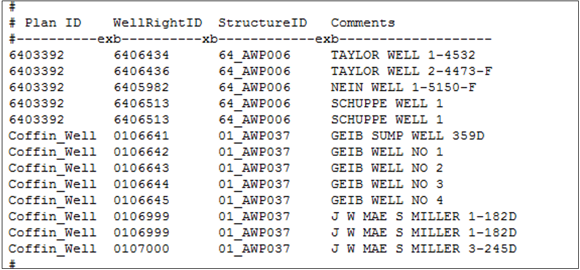

# Augmentation Plan Structure #

A Plan Type 2 – Well Augmentation Plan structure is used to track the augmentation requirement associated 
with well pumping in a model scenario for the current and future time steps. The augmentation requirement, 
or the difference between the depletions to the river and the accretions from any return flows, is generated 
during model simulation and serves as the plan demand. This plan demand can be “met” by several supplies as 
discussed in the sections below.  Note that StateMod only accounts for the augmentation requirement and 
supplies used to offset this plan demand; it does not limit well pumping if the supplies are insufficient 
to meet the full plan demand. The plan demand and supplies are reported in the plan summary (\*.xpl) file and 
it is up to the user to confirm, if appropriate, that the full augmentation requirement is being offset. 

1. Open the network (\*.net) in StateDMI, navigate to the appropriate location, and right-click to `Add an 
Upstream Location`. Enter the appropriate location and structure information and designate the structure 
type as a plan. 
	* Note that an augmentation plan generally accounts for the augmentation requirement from multiple 
	wells, therefore the plan should be included at a location on the river where a majority of the 
	depletions impact the river.
	* The augmentation requirement will be administered at the location of the plan, therefore the location 
	can impact how much of the plan demand is in-priority or what supplies are available to offset the demand.
	* Augmentation plans are assigned WDID’s in HydroBase; it is recommended this identifier be used as the 
	plan ID in the model.
2. Recreate the river network file (\*.rin) to reflect the additional structure.
3. In the plan file (\*.pln), include the well augmentation plan as a Type 2 Plan and include the appropriate 
parameter information. See [Section 4](../InputDescription/40.md) for more discussion on the information in 
and format of this file.
4. Using a text editor, create the well augmentation plan data (\*.plw) file to associate individual wells to 
an augmentation plan. See [Section 4](../InputDescription/40.md) for more discussion on the information in 
and format of this file. 
	* HydroBase contains the association of well ID’s to augmentation plans in its Association Table, however 
	there is not a command driven approach available in current versions of the data management interfaces 
	to query for the information and create the file. Therefore, this file is currently created outside of 
	the of DMI process using information from the Association Table (accessible through the Datastore 
	functionality in TSTool) and the well rights (\*.wer) file.  
	* Wells can be tied to multiple augmentation plans if the well right ID is distributed to the multiple 
	augmentation plans. 
	
	
    
    **

    Example Well Augmentation Plan Data (*.plw) File (<a href="../710_1_a.PNG">see also the full-size image</a>)
    
**

5. In the operating rule (\*.opr) file, include an In-Priority Supply Operating Rule (Type 43) to define the 
priority date of the augmentation plan indicating when depletions to the river would not need to be augmented. 
StateMod uses the priorities of the individual wells from the well rights (\*.wer) file to determine if any 
depletions that occur in the same time step are in or out of priority. If in-priority, the augmentation 
requirement is reduced to reflect the in-priority depletion. Due to the number of wells typically included 
in a model, it is impractical to analyze each individual well priority to determine if future depletions are 
in or out of priority, therefore a common priority associated with the Type 43 operating rule is used. 
	* In some instances, the augmentation plan decrees include a specific priority at which the depletions 
	do not have to be augmented. If so, use this date as the priority of the Type 43 rule.
	* If no date is provided in the decree, calculate a decree-weighted average priority for the wells 
	associated with the well augmentation plan. 
6. Review the plan summary (\*.xpl) file for information on the total augmentation requirement (plan demand) 
based on the lagged depletions and accretions, and the portion of the augmentation requirement that impacted 
the river when the well rights or augmentation plan was in-priority. The remainder of the augmentation plan 
should be offset using one or more of the supplies discussed below, however it is up to the user to ensure 
the full augmentation requirement is offset.