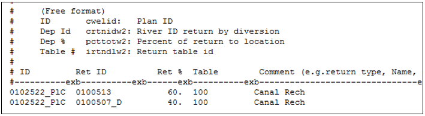
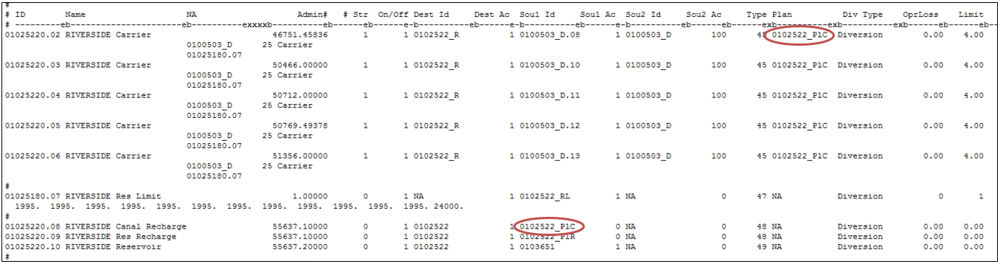

# Canal Loss (Seepage) as an Augmentation Supply #

StateMod allows canal loss (seepage) to be used as an augmentation plan supply and estimates the amount 
of this supply based on the amount of water carried to a demand, the efficiency of the canal, and the 
location and timing the canal loss (seepage) accrues to the river. The lagged canal loss is stored in a 
specific recharge plan and can then be “released from” (accounted at) the plan as a supply to offset an 
augmentation requirement.  Canal loss used as an augmentation supply must be designated by an operating 
rule and therefore requires a carrier structure that diverts to meet a separate demand. Canal loss experienced 
by a diversion structure diverted based only on a diversion right cannot be stored in a recharge plan. As canal 
loss is reaching the river regardless if there is an augmentation requirement, the recharge plan only accounts 
for the loss as a supply in the given time-step the lagged canal loss accrues to the river and the plan does not 
need to be “spilled”.

1. Open the network (\*.net) in StateDMI, navigate to the appropriate location, and right-click to `Add an 
Upstream Location`. Enter the appropriate location and structure information and designate the structure type 
as a plan. 
	* It is recommended the plan ID reflect the augmentation plan ID it will supply along with a suffix indicating 
	it will store canal loss (e.g. _PlC for the Plan Canal).
2. Recreate the river network file (\*.rin) to reflect the additional structure.
3. In the plan file (\*.pln), include the canal loss recharge plan as a Type 8 Plan and include the appropriate 
parameter information. See [Section 4](../InputDescription/40.md) for more discussion on the information in and format of this file.
4. Using a text editor, create the plan return (\*.prf) file which includes return flow data used to route the 
canal loss back to the river. See [Section 4](../InputDescription/40.md) for more discussion on the information in and format of this file.
	* The return flow location and patterns in the plan return (\*.prf) file should be similar to the return flow 
	information for the carrier structure in the diversion station (\*.dds) file.  
	* Canal loss from the recharge plan may be routed to any number of stream locations using any number of unit 
	response functions, however the unit response functions must be included in the delay table (\*.dly or \*.urm) 
	file.
5. In the operating rule (\*.opr) file, include a Carrier with Transit Loss  (Type 45) operating rule from the 
carrier to the demand including the canal loss recharge plan in the rule (`creuse` field). The second line of 
the Type 45 operating rule indicates the percent of canal loss.  
	* Note that in many cases, only the canal loss associated with specific water rights can be used as an 
	augmentation supply. Include the canal loss recharge plan only with operating rules carrying water rights 
	with their canal loss decreed as an augmentation supply.
	* Consider including a Release Limit Plan in the operating rule to limit the overall total of all recharge 
	supplies, including canal loss recharge.
6. In the operating rule (\*.opr) file, include a Plan/Reservoir Reuse to Plan by Direct or Exchange 
(Type 48 and 49) operating rule in order to apply the water stored in the canal loss recharge plan to offset 
augmentation requirement.  
	* Note that the water stored in the plan is the lagged accretions to the river and will offset the lagged 
	depletions in the augmentation plan in the same time step, if any. 
	* The source in this rule is the canal loss recharge plan and the destination is the augmentation plan.
	* If no Type 48 or 49 rule is included, the canal loss will return to the system but is not considered as 
	an augmentation supply, therefore a Plan Spill (Type 29) operating rule is not needed.
7. Review the plan summary (\*.xpl) file for information on the total canal loss recharge plan supply and 
the portion of the augmentation requirement that was offset by the supply. 

    
    **

    Example Plan Return (*.prf) File (<a href="../710_2_a.PNG">see also the full-size image</a>)
    
**
	
	
    **

    Example Operating Rule (*.opr) File (<a href="../710_2_b.PNG">see also the full-size image</a>)
    
**
