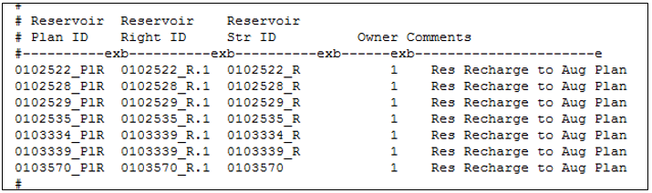
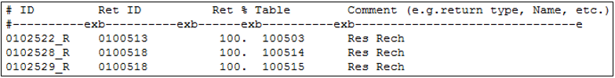
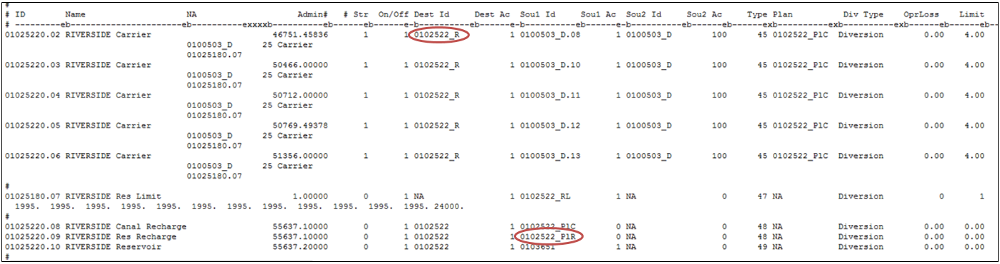

# Reservoir Recharge (Seepage) as an Augmentation Supply #

StateMod allows reservoir recharge (seepage) to be used as an augmentation plan supply and estimates the 
amount of this supply based on the amount of water carried to the reservoir/recharge area, the efficiency 
of the carrier, the seepage rate assigned to the reservoir/recharge area, and the location and timing the 
reservoir recharge (seepage) accrues to the river. The reservoir recharge is stored in a specific recharge 
plan and can then be “released from” (accounted at) the plan as a supply to offset an augmentation requirement. 
As reservoir recharge is reaching the river regardless if there is an augmentation requirement, the recharge 
plan only accounts for the loss as a supply in the given time-step the lagged reservoir recharge accrues to 
the river and the plan does not need to be “spilled”.

Representing reservoir recharge as an augmentation supply requires the inclusion of both a recharge plan and 
the reservoir recharge area. Recharge areas are included in the model as reservoirs, and as such, require 
content information to be included in the reservoir target (\*.tar) file. As most recharge areas are designed 
to seep their entire contents, the end-of-month contents of the recharge area is often zero and the target 
does not serve as a limitation to the amount of water carried to the reservoir. The user may consider 
implementing a release limit plan on diversions to the recharge area to prevent the recharge area from 
“over-recharging” therefore simulate operations closer to the historical conditions. 

Augmentation plans that have reservoir recharge as a supply generally have several recharge areas associated 
with the plan. The user may consider aggregating the recharge areas into a single modeled recharge area for 
the plan, or aggregate the recharge areas by return flow timing (e.g. aggregate those with a longer accretion 
pattern separate from those with a shorter accretion pattern). 

1. Open the network (\*.net) in StateDMI, navigate to the appropriate location, and right-click to `Add an 
Upstream Location`. Enter the appropriate location and structure information and designate the structure 
type as a reservoir. 
	* Recharge areas are assigned WDID’s in HydroBase; use this as the model ID if representing the recharge 
	area explicitly. If aggregating recharge areas, it is recommended the reservoir ID reflect the augmentation 
	plan ID it will supply along with a suffix indicating it is a recharge area (e.g. `_R`).
2. While in the network (\*.net) in StateDMI, navigate to the appropriate location, and right-click to `Add an 
Upstream Location`. Enter the appropriate location and structure information and designate the structure type 
as a plan. 
	* It is recommended the recharge plan ID reflect the augmentation plan ID it will supply along with a 
	suffix indicating it will store reservoir recharge (e.g. `_PlR`).
3. Recreate the river network file (\*.rin) to reflect the additional structure.
4. Add the recharge area to the reservoir station file (\*.res) using the StateDMI commands:
	* Set the total capacity of the reservoir in AF.
	* Set individual accounts (e.g. users in the reservoirs if recharge aggregate serves more than one 
	augmentation plan), their respective capacities, and their starting volumes.
	* Set the net evaporation station; must reference the evaporation station provided in the evaporation 
	file (\*.eva).
	* Set the area/capacity/seepage table; the seepage information is included as acre-feet of seepage in 
	each time step per volume of the reservoir. For example, if a 500 acre-foot recharge area can seep half 
	of its contents in one month, the seepage for the 500 acre-foot volume would be 250 acre-feet. 
5. Add water rights to the reservoir right file (\*.rer) using the StateDMI commands:
	* Recharge operations are generally operated based on a direct recharge right, however a reservoir 
	right is still needed for use in the plan recharge (\*.plr) file. 
	* Set the water right ID as the structure ID with a numeric suffix for each right.
	* Set the water right priority (administration number) and amount in AF.
	* Set the accounts that can be filled with the water rights and whether it is a first-fill or refill 
	right.
6. Add the structure’s demand to the reservoir target file (\*.tar) using the TSTool commands.
	* Set the monthly reservoir minimum and maximum targets (generally zero and the reservoir capacity) 
	or read in an external StateMod formatted file (\*.stm) with the capacity target in AF. See comments 
	at the beginning of this section regarding issues with recharge areas reaching their target demands.
7. In the plan file (\*.pln), include the recharge plan as a Type 8 Plan and include the appropriate parameter 
information. See [Section 4](../InputDescription/40.md) for more discussion on the information in and format of this file.
8. Using a text editor, create the plan recharge (\*.plr) file which ties the recharge areas and their 
rights to a recharge plan ID. Note that recharge areas can be associated with more than one recharge plan. 
See [Section 4](../InputDescription/40.md) for more discussion on the information in and format of this file.
9. Using a text editor, create the reservoir return (\*.rrf) file which includes return flow data used to 
route the reservoir recharge back to the river. See [Section 4](../InputDescription/40.md) for more discussion on the information in 
and format of this file.
	* Reservoir recharge may be routed to any number of stream locations using any number of unit response 
	functions, however the unit response functions must be included in the delay table (\*.dly or \*.urm) file.
10. In the operating rule (\*.opr) file, include a Carrier with Transit Loss  (Type 45) operating rule from 
the carrier to the recharge area, and if appropriate, include the canal loss recharge plan in the rule 
(`creuse` field). The second line of the Type 45 operating rule indicates the percent of canal loss.  
	* Note that recharge areas are generally located off-channel and therefore need operating rules that carry 
	recharge water to them. 
	* In many cases, the recharge areas are filled under a direct diversion right decreed for recharge, 
	which allow for credit to be taken on the canal loss associated with the diversions to the recharge area. 
	Therefore the source of the Type 45 operating rule is the direct recharge right and the destination is 
	the recharge area.
	* Consider including a Release Limit Plan in the operating rule to limit the total overall supplies, 
	including the amount carried to the recharge area each time step.
11. In the operating rule (\*.opr) file, include a Plan/Reservoir Reuse to Plan by Direct or Exchange (Type 48 
and 49) operating rule in order to apply the water stored in the recharge plan to offset augmentation requirement.  
	* Note that the water stored in the plan is the lagged accretions to the river and will offset the lagged 
	depletions in the augmentation plan in the same time step, if any. 
	* The source in this rule is the recharge plan and the destination is the augmentation plan.
	* If no Type 48 or 49 rule is included, the reservoir recharge will return to the system but is not 
	considered as an augmentation supply, therefore a Plan Spill (Type 29) operating rule is not needed.
12.	Review the plan summary (\*.xpl) file for information on the total recharge plan supply and the portion 
of the augmentation requirement that was offset by the supply. 
13.	Review the reservoir summary output (\*.xre) file for output information on the recharge area, including 
the total supply, evaporation, and the seepage rate.

    
    **

    Example Plan Recharge (*.plr) File (<a href="../710_3_a.PNG">see also the full-size image</a>)
    
**

	
	
    **

    Example Reservoir Recharge (*.rrf) File (<a href="../710_3_b.PNG">see also the full-size image</a>)
    
**

	
    
    **

    Example Operating Rule (*.opr) File (<a href="../710_3_c.PNG">see also the full-size image</a>)
    
**