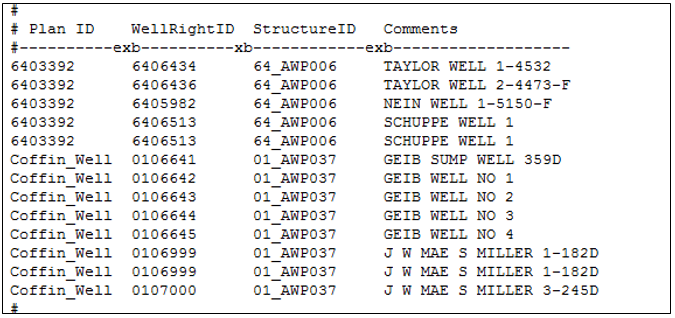

# Special Well Augmentation Plans #

A Plan Type 10 - Special Well Augmentation Plan is used to track the depletions associated with a well that 
is not required to be augmented. Examples include pumping in a designated basin or pumping by a well which 
has been decreed to be non-tributary (i.e. “coffin wells”). A special augmentation plan is typically used 
to demonstrate that every well in the model is assigned to an augmentation plan even if some wells are not 
required to augment their depletions. The plan demand, or the difference between the depletions to the river 
and the accretions from any return flows, is generated during model simulation. Unlike the Augmentation Plan, 
the Special Well Augmentation Plan is used for accounting only, and no supplies are modeled to “meet” the plan 
demand. 

1. Open the network (\*.net) in StateDMI, navigate to the appropriate location, and right-click to `Add an Upstream 
Location`. Enter the appropriate location and structure information and designate the structure type as a plan. 
	* Note that the special augmentation plan generally accounts for depletions from multiple wells, therefore the 
	plan should be included at a location on the river where a majority of the depletions impact the river.
2. Recreate the river network file (\*.rin) to reflect the additional structure.
3. In the plan file (\*.pln), include the well augmentation plan as a Type 10 Plan and include the appropriate parameter 
information. See [Section 4](../InputDescription/40.md) for more discussion on the information in and format of this file.
4. Using a text editor, create the well augmentation plan data (\*.plw) file to associate individual wells to a special 
well augmentation plan. See [Section 4](../InputDescription/40.md) for more discussion on the information in and format of this file. 
	* HydroBase contains the source (e.g. designated basin, non-tributary aquifers) for wells which provide information 
	on which wells would not need to be augmented, however there is not a command driven approach available in current 
	versions of the data management interfaces to query for the information and tie that information to the special 
	well augmentation plan. 

    
    **

    Example Well Augmentation Plan Data (*.plw) File (<a href="../710_6_a.PNG">see also the full-size image</a>)
    
**
	
5. In the operating rule (\*.opr) file, include a Plan/Reservoir Reuse to Plan by Direct (Type 48) operating rule 
to indicate to the model that a physical water supply is not required for these wells because well location (e.g. 
designated basin) or an administrative decision.  
	* The Special Well Augmentation Plan is used as the source and the destination in the operating rule.
	* The priority is generally set to the most junior in the model but it does not impact other operations.
	* The user may or may not include an In-Priority Supply Operating Rule (Type 43) with a specific priority to 
	determine what portion of the depletions would not need to be augmented if the depletions were brought into 
	the priority system.
6.	Review the plan summary (\*.xpl) file for information on the total lagged depletions (plan demand) associated 
with the special well augmentation plan.
