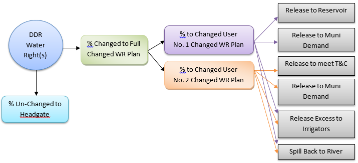

# How to Model Changed Water Rights and Return Flow Obligations #

Changed water rights, or water transfers, are represented in StateMod by “temporarily” diverting and storing the 
water right into a Changed Water Right Plan when in priority, then releasing the water from the plan to meet a demand 
at a priority determined by the user, often junior to the original right. Water diverted into the Changed Water Right 
Plan to temporarily store a diversion may or may not be used depending on other water supplies and/or operations. The 
correct implementation of a Changed Water Right plan and associated operating rules will account for:

* Administration of the changed water right at the correct location and at the correct priority
* Sharing shortages between all users, including any un-changed portion of the water right
* Use of the changed water right at priority different to the water right and relative to other operations in the model
* Capacity limitations of the existing headgate
* Decreed monthly and annual volumetrics and/or associated terms and conditions
* Availability of any unused changed water rights to other users in the system

The following schematic provides an example of Changed Water Rights operations; the plan structures and operating 
rules used to represent these operations are discussed in more detail below.

**

Figure 9 - Changed Water Rights Example Operations (<a href="../711_1.PNG">see also the full-size image</a>)

**