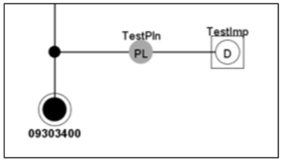
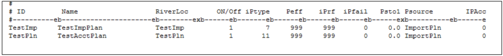

# How to Model Imported Water #

This section provides a recommended approach on how to model imported water into a river system using the standard 
modeling approaches taken during developing CDSS models. Special consideration of imported water in StateMod is recommended 
to make sure it is not reflected as natural flow or distributed as natural flow gains; it can be distributed to various 
users in the basin based on a specified order; and it can be tracked as a reusable supply as appropriate.  In general, the 
imported water is brought into the system, stored in a plan structure, and then released from the plan structure to specific 
users. The steps below discuss how the import can be added or included in an existing model, and do not explicitly discuss the 
steps required to complete the full model for natural flow or simulation scenarios.

**River Network Setup**

1. Open the network (\*.net) in StateDMI, navigate to the appropriate tributary (or create a new tributary for the imports), 
right-click to `Add an Upstream Location`, and add a diversion structure that will serve as import location. 
	* Enter the appropriate structure ID and naming information, and if desired, check the `Is Import?` box. This will include 
	a box around the diversion structure in the network diagram, but it is used for visual representation only, and is not used 
	by StateDMI when creating files or by StateMod.  

    
    

2.	In the network (\*.net) in StateDMI, right-click to `Add an Upstream Location`, and add a plan structure directly downstream of 
the import diversion structure that will serve as the import plan.
3.	Recreate the river network file (\*.rin) to reflect the additional structures.
4.	In the plan file (\*.pln), include the import diversion structure as a Type 7 Import Plan (must be same model identifier) and 
the import plan structure as a Type 11 Accounting Plan. 

    
    
    **

    Example Operating Rule (*.opr) File (<a href="../713_b.PNG">see also the full-size image</a>)
    
**
	
5.	In the diversion station (*.dds) file, include the import diversion structure with the following parameters:
	* Set the capacity of the structure to be greater than the maximum import amount 
	* Set the efficiency to be zero (i.e. 100 percent returns)
	* Set the return flow pattern and location to return the full amount in the same time step to the import plan structure.
	
**Natural Flow Scenario**

1.	In the historical diversion (\*.ddh) file, include the time series of the imported amount as a negative value under the 
import diversion structure ID.
	* Note that imported data is generally available in HydroBase under USGS streamflow gage identifiers, and can be converted to 
	negative values using scale function in TSTool. 
2.	With the import included, run the natural flow simulation using `StateMod Option 1 – Baseflow` if the input data (e.g. diversions, 
streamflow) is not complete, or `StateMod Option – BaseflowX` if the input data is complete.
3.	Review the baseflow result information summary (\*.xbi) file to ensure that the imported amount is reflected in the Import (Col 2) 
and accounted for in the natural flow calculations.

**Simulation Scenario**

1.	In the diversion demand (\*.ddm) file, include the time series of the imported amount as a negative value under the import diversion 
structure ID.
2.	In the operating rule (\*.opr) file, include the following rules at a minimum to operate the import plan:
	* Type 35 rule with the source as the import diversion structure and the destination as the import plan structure. This rule is 
	generally set as the most senior priority in the model. 
	* Type 27 and/or 28 rules with the source as the import plan structure and the destination as any structures that are to receive 
	imported supplies. Note that if the import water that is carried to a specific diversion structure using these rules is a reusable 
	supply, then include a reusable supply plan in the Type 27 or 28 rule. See the [How to Model Reusable Supplies section](../StandardModelingProcedures/714.md)) 
	for more information.
	* Type 29 with the source as the import plan structure and the destination as the next downstream node. Note that a destination node 
	is required for any Type 29 plan spill rules with an accounting plan source.
3.	With the import and operating rules included, run the simulation using `StateMod Option 2 – Simulation`.
4.	Review the plan summary (\*.xpl) file and operating rule summary (\*.xop) file for the portion of the imported water that was carried to 
meet each diversion demand and the portion, if any, that was unused and spilled back to the stream.