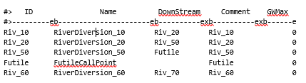

# How to Implement a Futile Call #

A futile call, as implemented in StateMod, allows a tributary stream to operate independently of the mainstem. Therefore, the 
impact of upstream diversions and return flows are not passed downstream of the futile call locations. This operating rule was 
originally developed for use in the Rio Grande, where dry stretches of the river can occur and create an opportunity for a futile 
call to extend upstream in these reaches.

1. In the river network (\*.rin) file, add a river node downstream of where a futile call occurs and keep the downstream location 
(`cstadn`) blank. 

    
    
    **

    Example River Network (*.rin) File with Futile Call (<a href="../715_a.PNG">see also the full-size image</a>)
    
**
	
>**Modeling Tips:**
>* _The river network (*rin) file isgenearlly created using StateDMI commands; this operation requires editing this file in a text editor. If so, these revisions will not be captured in a commands file and may be overwritten if the river network (*rin) file is recreated using StateDMI commands._
>* _This functionality has not been thoroughly tested or vetted; it is up to the user to verify these operations are simulating as desired._