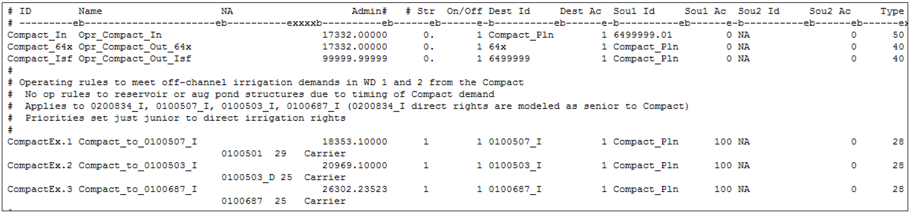

# South Platte Compact #

The South Platte Compact requires that Colorado deliver 120 cfs to the Stateline from April 1 to October 15 at an administration 
date of June 14, 1897, without calling out any diversions located upstream of the Washington County line (i.e. upstream of Water 
District 64). As StateMod operates water rights from senior to junior over the entire river system, the Washington County limitation 
was implemented by developing two operating rules specific to the Compact. A Type 50 operating rule is used to temporarily store 
water available to the South Platte Compact in a plan when in priority and a Type 40 operating rule is used to release water from the 
plan first to any structure that is water short and outside/upstream of Water District 64 and then to the Compact demand. The Type 
40 operating rule is used to determine if exchange potential exist which will allow a junior water right to exchange water from the 
Compact plan to meet their unmet demand. This check occurs immediately following the priority of a water right that is short.

* If exchange potential exists, water will be exchanged to the diversion limited by the structure’s demand, water right and capacity. 
In addition return flows will be calculated, a re-operation will occur and potentially allow water rights throughout the system to 
divert more water to meet their demands.
* If exchange potential does not exist, the water stays in the Compact plan.  

The Type 40 operating rule determines if the structure is outside/upstream of Water District 64 based on the first two digits of 
the model ID and does not exchange to any diversion structure with a `64*` model ID. Additionally, the Type 40 operating rule only 
exchanges to diversion structures located on-channel; exchanges to any off-channel demands (i.e. off-channel irrigation demands) in 
upstream reaches of the river will require a separate operating rule (Type 28).

1.	In the network (\*.net) via StateDMI, add one instream flow structure to the model located directly downstream of the South 
Platte River at Julesburg streamflow gage. Navigate to the appropriate location, right-click to `Add an Upstream Location`, enter 
the appropriate information, and designate the structure type instream flow.
2.	Recreate the river network file (\*.rin) to reflect the additional structures.
3.	Add the structure to the instream flow station file (\*.ifs) using the StateDMI commands:
	* Set the same ID for the upstream and downstream nodes to reflect a point.
	* Set the demand type variable to a 2 to indicate constant demand (\*.ifa) will be provided. 
4.	Add water rights to the instream right file (\*.ifr) using the StateDMI commands:
	* Set a 120 CFS water right with a June 14, 1897 (17332.00000 administration number)
5.	Add the structure’s demand to the instream flow demand file (\*.ifa) using the StateDMI commands.
	* Set the monthly instream flow demand to 120 CFS for April through September, 60 CFS for October to represent that the Compact 
	is only in effect through October 15th, and zero for the remaining months.
6.	In the plan file (\*.pln), include an accounting plan as a Type 11 Plan and include the appropriate parameter information. See 
[Section 4](../InputDescription/40.md) for more discussion on the information in and format of this file.
	* Set the River ID as the Compact Plan ID (e.g. `Compact_Pln`) and set the River Location as the Compact instream flow structure 
	ID indicating the Compact Plan will be administered at the instream flow structure location.
7.	In the operating rule (\*.opr) file, include a South Platte Compact Storage (Type 50) operating rule to temporarily store water 
available to the Compact in the Compact administrative plan. 
	* Set the administration date to a 17332.00000 administration number (June 14, 1897).
	* The source is the Compact instream flow right and the destination is Compact plan.
	* This rule turns off the source instream flow right so that it is completely controlled by the operating rule.
8.	In the operating rule (\*.opr) file, include a South Platte Compact Release (Type 40) operating rule to exchange Compact plan 
water to diversion structures located outside/upstream of Water District 64.
	* Set the administration date to a 17332.00000 administration number; however note that the administration number is not read 
	since this operating rule is called immediately following the priority of any water right that is water short and not located 
	in Water District 64.
	* The source is the Compact plan and the destination is `64x` indicating all diversion structures with a model ID that does 
	not start with a `64*`.
9.	In the operating rule (\*.opr) file, include a second South Platte Compact Release (Type 40) operating rule to release the 
water remaining in the Compact plan to the Compact instream flow demand.
	* Set the administration date to the most junior in the model (99999.99999). The Compact instream flow demand is first 
	satisfied by the physical water in the river, and if short, this rule releases from the Compact plan to meet the remaining 
	demand up to the amount available in the plan. Since the full plan amount is released to the instream flow, a spill plan 
	operating rule is not needed.
	* The source is the Compact plan and the destination is the Compact instream flow.
10.	In the operating rule (\*.opr) file, include Exchange Plan/Release (Type 28) operating rules for any off-channel demands 
located outside/upstream of Water District that are entitled to releases from the Compact plan if exchange potential is 
available.
	* Set the administration date to be junior to the diversion structure’s most junior supply.
	* The source is the Compact plan and the destination is the diversion structure ID.
	* Include carriers with losses, if applicable.

    
    
    **

    South Platte River Basin Model – Compact Operations Example (<a href="../7163_a.PNG">see also the full-size image</a>)
    
**
	
11.	Review the operating rule summary (\*.xop) file, the diversion structure summary (\*.xdd) file, the plan summary (\*.xpl) 
file, and the instream flow summary (\*.xir) file for information on the South Platte Compact operations and the amount of 
water released from the Compact plan for exchange.