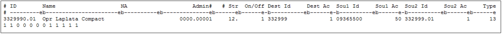

# La Plata Compact #

The La Plata Compact governs the distribution of water on the La Plata River between the states of Colorado and New Mexico. The 
administration is dependent upon the streamflow at two gaging stations: Hesperus Station (USGS No. 09365500) and Interstate Station 
(USGS No. 9366500). During the year from December 1 to February 14, each state has the right to use all water within its boundaries. 
For the remainder of the year, February 15 to November 30, allocation for La Plata River water is performed according to the 
following guidelines:

* If the flow at Interstate Station is greater than or equal to 100 cubic feet per second (cfs), each state has unrestricted rights 
to all water within its boundaries.
* If the flow at Interstate Station is less than 100 cfs, the State of Colorado shall deliver at the Interstate Station a quantity 
of water equal to one-half of the mean flow at the Hesperus Station for the preceding day, not to exceed 100 cfs.

During periods of extreme low flow, the guidelines above may be superseded by a method of administration that allows the delivery 
of all available water successively to each state in alternating periods. When flow at the Hesperus Station is less than 30 cfs, 
the lower reaches of the La Plata will run dry, and Colorado cannot deliver any water in accordance with No. 2 above.

The Type 13 operating rule was developed in order to implement the La Plata Compact in the San Juan River Basin model. This rule 
allows an instream flow to operate based on its location on the river and the flow at an upstream index streamflow gage. Although 
developed specifically for the La Plata Compact, this rule could be used for more generic applications in other models. 

1.	In the network (\*.net) via StateDMI, add one instream flow structure to the model at the Colorado – New Mexico state line 
and one “other” structure immediately downstream to reflect the instream flow reach. Navigate to the appropriate location, 
right-click to `Add an Upstream Location`, enter the appropriate information, and designate the structure type instream flow for 
the upstream instream flow structure and “other” type for the downstream structure.
	* `332999` and `332999_Dwn` are used as model IDs in the San Juan/Dolores River Basin models for the upstream and downstream 
	structures, respectively.
2.	Recreate the river network file (\*.rin) to reflect the additional structures.
3.	Add the structure to the instream flow station file (\*.ifs) using the StateDMI commands:
	* Set the upstream and downstream model IDs to reflect the reach. 
	* Set the demand type variable to a 2 to indicate constant demand (\*.ifa) will be provided.
4.	Add water rights to the instream right file (\*.ifr) using the StateDMI commands:
	* Set a 100 CFS water right with the most senior water right in the model (00001.00000 administration number).
5.	Add the structure’s demand to the instream flow demand file (\*.ifa) using the StateDMI commands.
	* Set the monthly instream flow demand to 100 CFS for April through November and zero for the remaining months.
	* Note that this demand provides the upper bound of demand; the Type 13 operating rule will calculate the instream flow 
	demand as the minimum of the Compact instream flow water right; the specified percent (e.g. 50%) of the flow at the Compact 
	gage (e.g. `09365500`); the instream flow demand (\*.ifa); and the available flow at the instream flow.  
6.	In the operating rule (\*.opr) file, include a La Plata Compact (Type 13) operating rule to define the index gages and 
percentages used to calculate the Compact instream flow demand.
	* Set the administration number to be senior (00001.0000 administration number).
	* The primary source is the index streamflow gage ID (`09365500`) and the percent of flow (50%); the secondary source is the 
	Compact instream flow water right.
	* This rule turns off the source instream flow right so that it is completely controlled by the operating rule.
	* Monthly on/off switches can be used to further refine the months when the Compact should be administered.
	* Using a very senior administration number in this operating rule, the Compact demand is typically equal to the natural 
	flow plus any lagged returns to the gage from upstream diversions in a prior time step multiplied by the specified percent 
	(e.g. 50%).

    
    
    **

    San Juan River Basin Model – Compact Operations Example (<a href="../7164_a.PNG">see also the full-size image</a>)
    
**
	
7.	Review the operating rule summary (\*.xop) file, the diversion structure summary (\*.xdd) file, and the instream flow summary 
(\*.xir) file for information on the La Plata Compact demand and operations.
	* As the Compact demands are calculated within the model, the information printed under the column titled “demand” in the 
	diversion station summary (\*.xdd) file is the minimum of the specified percent (e.g. 50%) of the flow at the compact gage 
	(e.g. `09365500`) and the instream flow demand  provided in the instream flow demand files.  
	* To obtain additional details (printed in the log file (\*.log) on the calculations associated with this operating rule the 
	control file variables ichk and ccall should be set to 113 (operating rule 13) and `3329990.01` (the operating right ID for the 
	La Plata Compact). 
