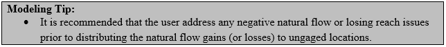
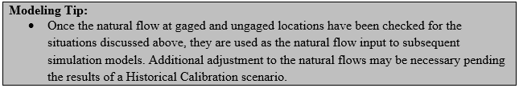

# How to Check for Natural Flow Issues #

Following are recommended checks to identify problems with natural flow estimates.

**Situation**: Negative baseflows occurring at stream gages or base flow nodes in model network. Negative baseflows occur 
when the gage flows is less than the other parameters used in the natural flow calculation. StateMod automatically sets 
any natural flow estimated to be negative at a gaged location to zero prior to distributing gains to ungaged locations, 
essentially “creating” water in the system. As natural flows represent the flow in the absence of man, negative natural 
flows are not physically based and likely caused by data inconsistencies. 

**Checks**:

* Review \*.log file from `–Base Flow` module for the Negative Flows summary. Identify extent of negative baseflows by the 
number of months (“Count” column) and magnitude of negative baseflows (“Est” column). Review monthly distribution of negative 
baseflows for the stream gage ID or base flow node ID in the Baseflow output (\*.xbi) summary file or time series (\*.xgn) file.
* For gaged locations, review the data used to calculate baseflows (diversions, return flows, reservoir contents). Filled 
data in diversion records, streamflow gage records, or reservoir contents can result in negative flow issues.
* Review the Baseflow output (\*.xbi) file for months with negative baseflows to determine which of the data used to calculate 
baseflows is causing the calculation to go negative. This is typically due to simulated return flows greater than historical 
gaged flows + upstream diversions or data filling techniques; particularly with regard to reservoir contents. 
* Review return flows above gage based on topography and acreage location because return flow are subtracted from gage data. 
Specifically investigate return flows to neighboring tributaries or other locations that bypass a gage. Mis-location of Return 
Flow ID’s (`crtnid`), Return Flow Percentages (`pcttot`), and Return Flow Locations (`irtndl`) in the diversion station (\*.dds) file 
can have a significant impact on calculated baseflows. 

**Situation**: The natural flow at an upstream gage is greater the natural flow at the downstream gage, essentially creating a 
“losing reach”.  As natural flows represent the flow in the absence of man, it is expected that as the drainage area increases 
from upstream to downstream, the natural flow increases from upstream to downstream as well.  Often times, the “losing reach” 
will be limited to sporadic months, however in rare cases, the upstream gage is greater than the downstream gage for the entire 
period. It is recommended that any “losing reaches” be addressed prior to distributing the gains (or losses) to ungaged locations. 

**Checks**:

* Check that natural flows increase from upstream to downstream. Use a graphical tool, such as TSTool or MS Excel, to quickly 
add the time series of natural flows from the \*.xbm file above each gage to assure they are equal or greater to the natural flow 
estimated at the downstream gage. 
* If losing reaches occur, use the files and techniques outlined in the “negative flow” discussion above to identify issues or 
data inconsistencies that may be the cause.
* If the “losing reach” is consistent throughout the entire period, it is recommended that the diversions, reservoir storage, 
imports, and return flows in the upstream reach be analyzed.  In some situations, the losing reaches are caused by incorrectly 
routed return flows, incorrect locations of diversions (above/below the gage), problems with physical representation of the basin, 
or imports that are included in the natural flow estimates.

**Situation**: More than 100 percent of the natural flow gains between gages are distributed to an ungaged location, 
resulting in “created” water and a “losing reach” at the downstream gage.  Gains are distributed to ungaged locations 
using either the “gain approach” or “neighboring gage approach”, both of which use a coefficient to distribute the gain 
or loss. 

**Checks**:

* In the gain approach, the coefficient is based on the incremental area below an upstream gage multiplied by the total 
average annual precipitation for the upstream drainage area. Review the area and precipitation values in the network (\*.net) 
to represent the appropriate values. 
* In the neighboring gage approach, review the assigned coefficients in the streamflow coefficient/baseflow file (\*.rib) to 
make sure that the distributed gains are not greater than 100 percent, especially if a gage was used for multiple ungaged 
locations.
* The gain approach assigns the distribution of gains for main stem gages to tributary gages. This may not be an adequate 
representation, in which case the neighboring gage should be used.

