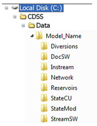

# How to Add or Change Modeled Input Data #

This section provides a recommended approach on how to add or change typical model data that follows the 
standard CDSS data-centered approach. The CDSS data-centered approach focuses on the flow of information 
from HydroBase or other data sources through data management interfaces (DMI) that correctly format the 
input files for the CDSS models (StateCU and StateMod). The data-centered approach means the process of 
developing the model, organizing the files, and documenting the model is consistent for every CDSS StateMod 
dataset; and that many of the major modeling decisions are documented in the command files of the DMI. 
There is a file dependency element to the data-centered approach whereby the creation of a StateMod file may 
be dependent on another file. Therefore it is important for the user to understand these dependencies as well 
as the recommended method for creating StateMod input files. 

To support the data-centered approach, a common directly structure was estimated by CDSS. As shown, the main 
directory contains subdirectories representing each aspect of the model.  For example, the Diversion folder 
contains command files and supporting files used to create the StateMod input files associated with diversions 
(e.g. diversion station (\*.dds) and diversion rights (\*.ddr) file). The actual input files are stored in StateMod 
folder. The DocSW folder includes the StateMod model documentation.

[Table 2](#table2) is a quick guide to assist the user as to which files and tools should be revised, or at a minimum reviewed, 
if a specific structure type is added or modified. The directory where the command files can be found is also shown. 
Note that the network files are associated input files with most structure types; the network diagram and the river 
network command file can be found in the `..\Network\` folder.

**

Table 2 - Quick Guide for Modifying StateMod Data Set Input Files

**

| Structure Type 					| Associated Input Files 					| Tool Generally Used to Create Input Files |
| ---------------------				| --------------------------------			| -----------------------------------		|
| Stream Gage ..\StreamSW\ 			| Network (\*.net)							| Edit network in StateDMI 
| 									| River Network File (\*.rin) 				| Commands in StateDMI
| 									| River Station File (\*.ris)				| Commands in StateDMI
| 									| Natural Flow (\*.xbm) 					| Output from Natural Flow scenario
| Diversion Node ..\Diversions\		| Network (\*.net)							| Edit network in StateDMI
| 									| River Network File (\*.rin)				| Commands in StateDMI
| 									| Direct Diversion Station File (\*.dds)	| Commands in StateDMI, generally dependent on a set of DDS adn DDH commands
| 									| Direct Diversion Right File (\*.ddr) 		| Commands in StateDMI
| 									| Direct Flow Demand File - Monthly (\*.ddm)| Commands in StateDMI
| 									| Delay Table (\*.dly or \*.urm)			| Edit in text editor
| Reservoir Node ..\Reservoirs\ 	| Network (\*.net)							| Edit network in StateDMI
| 									| River Network File (\*.rin) 				| Commands in StateDMI
| 									| Reservoir Station File (\*.res)			| Commands in StateDMI
| 									| Reservoir Right File (\*.rer) 			| Commands in StateDMI
| 									| Reservoir Target Content File - Monthly (\*.tar or \*.tam) | Commands in TSTool
| 									| Evaporation Data File - Annual (\*.eva) 	| Edit in text editor
| Instream Flow Node ..\Instream\	| Network (\*.net) 							| Edit network in StateDMI
| 									| River Network File (\*.rin)				| Commands in StateDMI
| 									| Instream Flow Station File (\*.ifs)		| Commands in StateDMI
| 									| Instream Flow Right File (\*.ifr) 		| Commands in StateDMI
| 									| Instream Flow Demand File - Monthly (\*.ifm)	| Commands in TSTool
| Plan Node ..\StateMod\			| Network (\*.net)							| Edit network in StateDMI
| 									| River Network File (\*.rin) 				| Commands in StateDMI
| 									| Plan Data (\*.pln) 						| Edit in text editor
| Operating Rules ..\StateMod\		| Operating Rule File (\*.opr) 				| Edit in text editor
| Model Scenario Files ..\StateMod\	| Response File (\*.rsp) 					| Edit in text editor
| 									| Control File (\*.ctl) 					| Edit in text editor 

>**Modeling Tips:**
>- _This section is not all-inclusive and does not provide instructions for more complex changes or additions. If the user needs to implement a change or addition not discussed herein, it is recommended the user refer to the completed CDSS StateMod models available on the CDSS website for examples of how to implement more complex changes._
>- _StateMod output files reflect the same filename as the response file (*.rsp); use descriptive response file names to manage different scenarios and for easier comparisons._