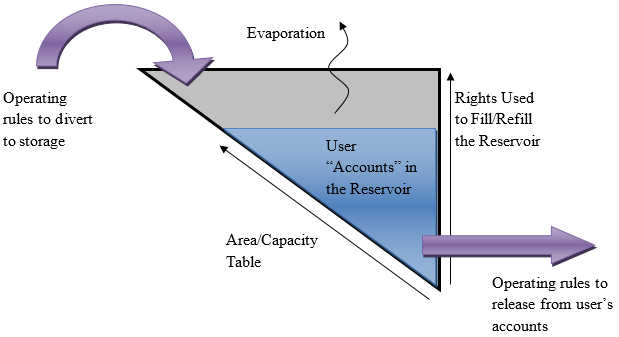

# How to Model Reservoir Operations #

This section provides a recommended approach on how to model typical reservoir operations using the standard 
modeling approaches taken during developing CDSS models. As illustrated in [Figure 8](#figure8), reservoir operations involve 
the reservoir station file (\*.res), reservoir right file (\*.rer), reservoir target file (\*.tar), evaporation file 
(\*.eva), and the operating rule file (\*.opr). StateMod simulates operations of reservoirs in the model based on 
the input from these files. 

Figure 8 - Reservoir Operations Illulstration (<a href="../75_1.PNG">see also the full-size image</a>)

**Modeling Tips:**
* _This section is not all-inclusive and does not provide instructions for more complex reservoir operations. If the user needs to implement a change or addition not discussed herein, it is recommended the user refer to the completed CDSS StateMod models available on the CDSS website for examples of how to implement more complex reservoir operations._ 
* _Review the Colorado DWR General Administrative Guidelines for Reservoirs (Oct. 2011) for more information on the terminology used and impact of specific parameters in the reservoir files._
