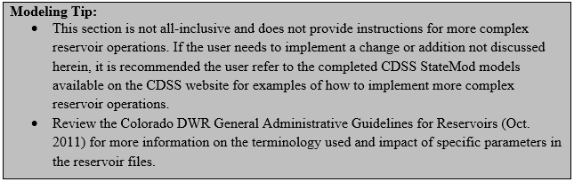

# How to Model Reservoir Operations #

This section provides a recommended approach on how to model typical reservoir operations using the standard 
modeling approaches taken during developing CDSS models. As illustrated in [Figure 8](#figure8), reservoir operations involve 
the reservoir station file (\*.res), reservoir right file (\*.rer), reservoir target file (\*.tar), evaporation file 
(\*.eva), and the operating rule file (\*.opr). StateMod simulates operations of reservoirs in the model based on 
the input from these files. 

**

Figure 8 - Reservoir Operations Illulstration (<a href="../75_1.PNG">see also the full-size image</a>)

**

