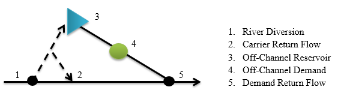

# How to Model Off-Channel Reservoir Systems #

Off-channel reservoirs require special consideration in StateMod, both during natural flow development and 
during simulation scenarios.  Although off-channel reservoir systems generally reflect off-channel reservoirs 
that serve irrigation demands, this approach can be adapted for any structure that carries to more than one 
off-channel demand. For example, a structure that carries to irrigation, municipal, and augmentation demands. 
As diversions to both off-channel reservoirs and irrigation demands are more common in the South Platte River 
Basin as compared to other basins, the following standard CDSS modeling approach to representing these systems 
was developed during the South Platte Decision Support System modeling effort. The key aspects of this approach 
allow:  

* Baseflows to be calculated correctly without special considerations of baseflow gage locations
* Total historical diversion from the river to remain at the river location,
* End-Of-Month (EOM) contents in the reservoir to be represented by historical values,
* Return flows to be accounted for at the correct locations and operated either by variable efficiency 
(for irrigation structures) or by a constant efficiency (for carrier structures).

**
Figure 9 - Off-Channel Reservoir System Schematic (<a href="../76_1.PNG">see also the full-size image</a>)**

**River Network Setup**
The off-channel system is represented as a “mock” tributary in the network diagram and connected to the network 
at the furthest downstream location of return flows from the off-channel demand(s). It is recommended that the 
off-channel demands use their primary source WDID as an identifier if appropriate, or an appropriate suffix attached 
to the river diversion WDID (e.g. 0100503_I for irrigation demands served by 0100503).

**Natural Flow Calculations**
The natural flow calculations on the mainstem of the river network will be calculated correctly because of the following 
considerations:

* The river sees the entire historical diversion at Location 1
* Return flows from carrier losses are accounted for in their correct location
* Returns from the river diversion to the off-channel tributary are balanced by increases in storage and diversion at 
off-channel demand structure(s)
* Reservoir releases are balanced by diversions at off-channel demand structure(s),
* Return flows from off channel demands are accounted for in their correct location.

The following approach is recommended to implement an off-channel reservoir system in natural flow calculations.

*River Diversion (Location 1)*

* Historical diversions are equal to total river diversions, including all water diverted to storage and to other 
demands from this location. Note that in some cases total diversions may need to be calculated, especially winter 
diversions, due to lack of diversion records and changes in diversion coding over time. Winter diversions to storage 
can be estimated based on the change in reservoir end-of-month content from one month to the next and accounting for 
evaporation.
* The structure is 0% efficient, as set in the direct diversion station (\*.dds) file, which results in 100% of the 
water diverted at this structure to be returned as follows:
	* Use the return flow location(s), percentage(s), and delay pattern(s) in the direct diversion station (\*.dds) file 
	to route the conveyance loss back to the correct location. *This is represented by Location 2 in the figure above*.
	* Use the return flow location(s), percentage(s), and delay pattern(s) in the direct diversion station (\*.dds) file 
	to return the total diversions less ditch loss to the upstream most node in the off-channel system in the same time 
	step. *This is represented by Location 3 in the figure above*.
	* For example, if Location 1 is 75 percent  efficient, the direct diversion station (\*.dds) file for the river 
	diversion will reflect 25 percent lagging back to the river to Location 2, and 75 percent returns in the same time 
	step to Location 3. 
* Additional information needs to be set in the direct diversion station (\*.dds) file so that the basin wide 
summary tables do not double account diversions for these systems:
	* `demsrc(1)` set to 7 – carrier structure.

*Off-Channel Reservoir (Location 3)*

* Values in the end-of-month (\*.eom) file are based on historical end-of-month reservoir content.

*Off-Channel Demand (Location 4)*

* Historical diversions are equal to water delivered from the river diversion (Location 1) minus conveyance losses 
plus releases from the off-channel reservoir (Location 3), if applicable. Note that reservoir releases are calculated 
based on change in reservoir end-of-month content from one month to the next and accounting for evaporation.
* Return flow location(s), percentage(s), and delay pattern(s) in the direct diversion station (\*.dds) file for this 
structure are based on locations of returns from the use. *This is represented by Location 5.*

>**Modeling Tips:**
>* _If the off-channel system is modeled correctly and all the diversion and reservoir data is consistent, the natural flow for the off-channel tributary would be zero._
>* _If there are data inconsistencies between diversion and reservoir data or the system is not represented correctly in the model, StateMod will estimate natural flow from this tributary._
>* _Use a "calibration" streamflow gage (a streamflow gage with zero streamflow) at the bottom of the "mock" tributary to determine if there is natural flow being estimated for the off-channel system._
>* _Once data inconsistencies are corrected and the estimate of natural flow at the calibration gage is minimal/zero, the gage needs to be removed from the network (or set to an Other structure type) before simulation scenarios are run._

**Simulation Scenarios**

Simulation scenarios will operate the system correctly because all demands (reservoir, irrigation, etc.) in the 
off-channel system will be satisfied by carried water from the river diversion via operating rules. This ensures 
that water is delivered only in amounts up to what is needed for the off-channel system. If setup correctly, there 
will not be excess water returning from the off-channel system via the physical network connection (via the river). 
The following approach is recommended to implement an off-channel reservoir system in simulation scenarios.

*River Diversion (Location 1)*

* Historical and baseline demands are set to zero in the diversion demand (\*.ddm) files.
* The structure is 0% efficient, as set in the direct diversion station (\*.dds) file, which results in 100% of 
the water diverted at this structure to be returned as follows:
	* Use the return flow location(s), percentage(s), and delay pattern(s) in the direct diversion station (\*.dds) 
	file to route the conveyance loss back to the correct location. *This is represented by Location 2 in the figure 
	above*. 
	* As operating rules will be simulating the diversions from this structure, the return flows at this structure 
	need to reflect only the conveyance loss routing.
* Use operating rules in the operating rule (\*.opr) file to divert water to storage (*Location 3*) and/or to the 
off-channel demand (*Location 4*) via the river diversion structure.
	* Reservoir water rights are located at the reservoir and operating rules will carry water to the reservoir 
	via the river diversion structure using the reservoir right as the source water right. 
	* Diversion rights are located at the river headgate and operating rules will carry water to the off channel 
	demand via the river diversion structure using the diversion right as the source water right.

*Off-Channel Reservoir (Location 3)*

* Set the demand in the historical reservoir target (\*.tar) file to the historical end-of-month reservoir content.
* Set the demand in the baseline reservoir target (\*.tar) file to the full reservoir capacity.
* Use operating rules in the operating rule (\*.opr) file to release water from storage to the off-channel 
demand (*Location 4*).

*Off-Channel Demand (Location 4)*

* Historical demands in the historical diversion demand (\*.ddm) file are set to the historical diversions 
calculated for natural flow calculations; i.e. water delivered from the river diversion (*Location 1*) minus 
conveyance losses plus releases from the off-channel reservoir (*Location 3*), if applicable. 
* Baseline demands in the baseline diversion demand (\*.ddm) file are based on the irrigation water requirement 
or other appropriate off-channel demand. 
