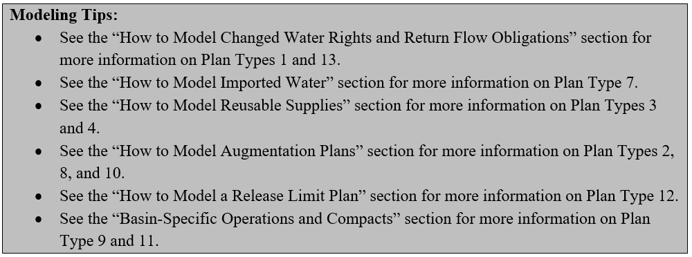

# How to Model Plan Structures and Operations #

StateMod uses plan structures to model complex operations, such a reusable supplies, recharge supply and 
augmentation demands, terms and conditions, changed water rights, out of priority plans, and imports. The 
specific operation desired by the user is defined by the type of plan structure used, the associated plan 
input files, and the array of operating rules required to operate the plan structure.  

As with any other structure type, plan structures must be included in the network diagram and river network 
(\*.rin) file at the location where the plan is to be implemented. For example if the terms and conditions of 
a transfer require historical return flows be maintained at the transfer location, then a Term and Condition 
(T&C) Plan should be located just downstream of the transfer location. Similarly if a reuse plan allows 
releases from a water treatment plant to be reused then a Non-Reservoir ReUse Plan should be located just 
below the treatment plant discharge. 

StateMod currently supports the operation of the following 11 plan types; refer to the Modeling Tip at the end 
of this section to find more information on these operations.  The user specifies the plan type and other 
specific parameters in the plan structure (\*.pln) file; see [Section 4](../InputDescription/40.md) for more 
discussion on the information in and format of this file. Note that Plan Types 5 and 6 are intentionally 
omitted; they are no longer used in StateMod. 

**Type 1 - T&C Plan** is used to store a future obligation associated with the transfer of water from one structure to another.  For example, a water right transfer might require historical return flows be maintained as part of the transfer.  When a T&C plan is specified, StateMod calculates the obligation for the time step it occurs and all associated future time steps. Future returns and/or depletions are estimated using the same delay information specified for the source structure or in the operating rule that includes the T&C plan. 

**Type 2 - Well Augmentation Plan** is used to store a future obligation to return water to the river (augment) when a well depletes the river out of priority. When a Well Augmentation Plan is specified, StateMod calculates the current and future obligation for the time step it occurs and all associated future time steps. Future returns and/or depletions are estimated using the same delay information specified for the source well structure.  

**Type 3 - Reservoir Reuse Plan** is used to store a reusable water supply associated with a reservoir.  As the reuse plan represents water stored in the reservoir, any unused water can be carried over in the plan to the next time step.  

**Type 4 - Diversion Reuse Plan** is used to store a reusable water supply associated with a diversion.  As the reuse plan is associated with a diversion, any unused water must be spilled since it cannot be carried over to the next month.

**Type 7 - Transmountain Import Plan** is used to account for imported water which, in many cases, may be used to extinction.  The return flows generated from deliveries from a Type 7 plan are typically stored in Type 3 or Type 4 Reuse Plans. See the [How to Model Imports](../StandardModelingProcedures/713.md) section for more information on this plan type and import operations.

**Type 8 - Recharge Plan** is used to store a water supply that originated from reservoir, recharge area, or canal seepage.  The water supply from this plan is typically used to meet a well augmentation demand generated in a Type 2 plan. The return to the river is controlled by a unit response table therefore it accrues to the river as a supply even if it is not assigned to a demand.  

**Type 9 - Out of Priority Plan** is used to store a future obligation associated with water that is diverted out of priority.  These plans are typically used to represent out-of-priority diversions to storage pursuant to the upstream storage statute (e.g. Blue River decree diversions by Denver and Colorado Springs).

**Type 10 - Special Well Augmentation Plan** is used to store the depletion associated with a well that is not required to be augmented.  Examples include pumping in a designated basin or pumping by a well which has been decreed to be non-tributary (i.e. “coffin wells”).  A special augmentation plan is typically used to demonstrate that every well in the model is assigned to an augmentation plan even if some wells are not required to augment their depletions.

**Type 11 - Accounting Plan** is used to “temporarily” divert water in priority which may subsequently be used at a later point in the priority system or by a number of other structures.  Note this plan type was historically used for changed water rights, however due to the complexity of those operations, Plan Type 13 was developed exclusively for those operations. The Type 11 plan is still used in special operations such as the South Platte Compact.

**Type 12 - Release Limit Plan** is used to limit the cumulative supply from multiple sources to monthly and annual values. This plan is typically included in a series of other operating rules to limit the total amount of diversions or reservoir releases to a user-specified monthly or annual amount.

**Type 13 – Changed Water Rights Plan** is a specific type of accounting plan that is used to handle changed water right operations, allowing water to be “temporarily diverted” in priority, split to other Type 13 plans if the changed right has more than one owner, then released at a later priority to meet demands.  

