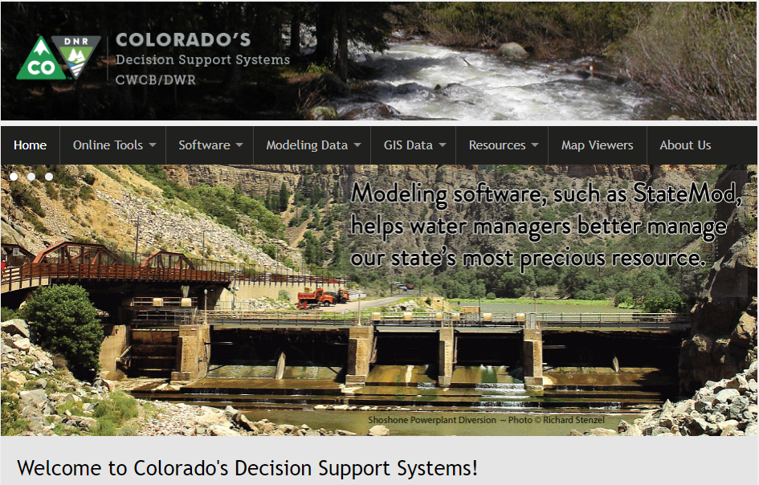

# StateMod Documentation #

This documentation is the user manual for Colorado's Decision Support Systems (CDSS) StateMod water allocation model software.

The State of Colorado's Stream Simulation Model (StateMod) is a water allocation and accounting model
capable of making comparative analyses of various historical and future water management policies in a river basin.
It is designed to be applied to any river basin through appropriate input data preparation. 

**This documentation is a work in progress, with the initial online version including references to the existing PDF format
and examples to illustrate use of online documentation features.**

This documentation page includes the following sections:

* [How to Use this Documentation](#how-to-use-this-documentation) - guidance and list of main documentation sections
* [Colorado's Decision Support Systems (CDSS)](#colorados-decision-support-systems-cdss) - the system under which the software is maintained
* [License](#license) - license for software and this documentation
* [Source Repository on GitHub](#source-repository-on-github) - location of StateMod repository in GitHub

------------

## How to Use this Documentation ##

This documentation is the user documentation for the StateMod software.
Major sections of the documentation currently consist of the legacy Word/PDF documentation. 
The legacy PDF documents are referenced from web pages for each section of the user documentation,
using the original chapter numbers.
Some shorter sections have been converted to online form.
The legacy documentation may be fully converted to online navigable form at some point.

Use the navigation menu on the left to select pages and the navigation menu on the right
to select sections within a page.
The navigation menus may be collapsed if viewing in a narrow window or mobile device.

* See the [Full legacy documentation as PDF](legacy/StateMod Version 15 Documentation.pdf) (note that the links work
but ***Back*** may return to this page).

## Colorado's Decision Support Systems (CDSS) ##

Colorado's Decision Support Systems (CDSS, [cdss.state.co.us](http://cdss.state.co.us))
has been developed to answer important questions about Colorado's water resources.
CDSS efforts are led by the [Colorado Water Conservation Board (CWCB)](http://cwcb.state.co.us)
and [Colorado Division of Water Resources (DWR)](http://water.state.co.us).

One component of CDSS is the StateMod water allocation model, which estimates water allocation given water supply and demand and
physical and legal (water right) constraints on water decisions.
StateMod results are linked to the StateCU consumptive use model and in some basins the MODFLOW groundwater model.

In late 2016, the CWCB funded the OpenCDSS project to move StateCU and other CDSS software to open source licensing
and establish open source software projects.
The [Open Water Foundation](http://openwaterfoundation.org) was contracted to lead the OpenCDSS project.

## License ##

The license for this documentation is the [Creative Commons CC-BY 4.0 license](https://creativecommons.org/licenses/by/4.0/).

## Source Repository on GitHub ##

The source files for this documentation are maintained in the public GitHub repository for StateMod: [cdss-app-statemod-fortran-doc-user](https://github.com/OpenWaterFoundation/cdss-app-statemod-fortran-doc-user).
Documentation website files currently are copied to the Open Water Foundation [Learn StateMod](http://learn.openwaterfoundation.org/cdss-learn-statemod/) website,
and will be copied to an OpenCDSS website once software tools are made available publicly.

## Release Notes ##

Release notes for StateMod and this documentation will be implemented as the open source migration is finalized.
