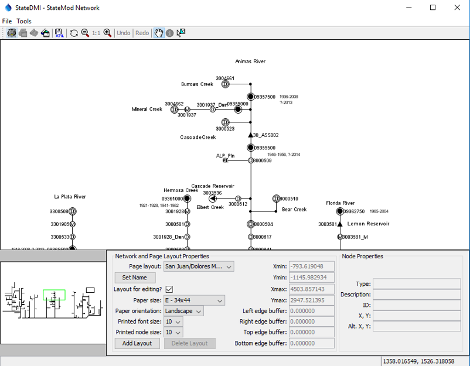

# StateMod User Documentation #

**

StateMod Model version 15

**

**

Last updated December, 2019

**

# Disclaimer #

This program is furnished by The State of Colorado (State) and is accepted and used by the recipient upon the expressed understanding that the State makes no 
warranties, express or implied, concerning the accuracy, completeness, reliability, usability, or suitability for any particular purpose of the information 
and data contained in this program or furnished in connection therewith, and the State shall be under no liability whatsoever to any person by reason of any 
use made thereof.

The program herein belongs to the State of Colorado. Therefore, the recipient further agrees not to assert any proprietary rights therein or to further 
represent this program to anyone as other than a State program.

# License #

This StateMod documentation is licensed using the
[Creative Commons Attribution International 4.0 (CC BY 4.0) license](https://creativecommons.org/licenses/by/4.0/).

The StateMod software is licensed using the GPL 3 license (see the [StateMod software repository](https://github.com/OpenCDSS/cdss-app-statemod-fortran)).

# Source Repository on GitHub #

The source files for this documentation are maintained in a GitHub repository:
[cdss-app-statemod-fortran-doc-user](https://github.com/OpenCDSS/cdss-app-statemod-fortran-doc-user).

This user documentation is maintained in a repository that is separate from StateMod code
in order to facilitate contributions by non-programmers.